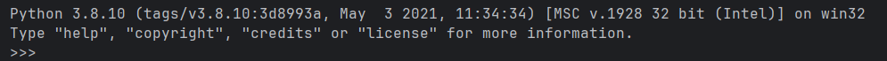
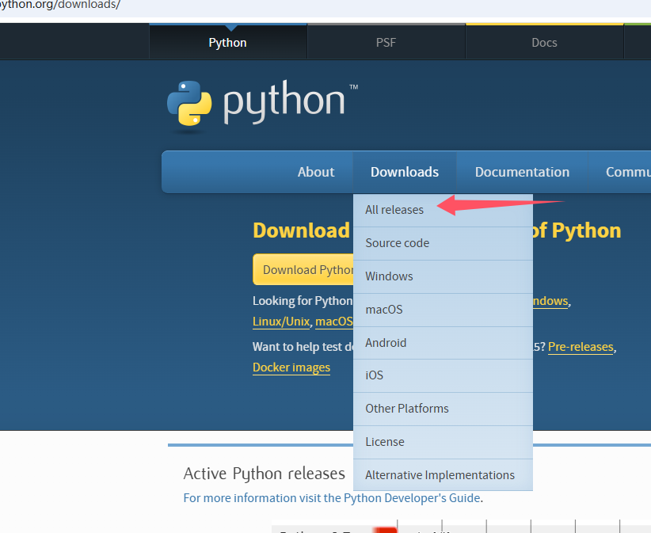
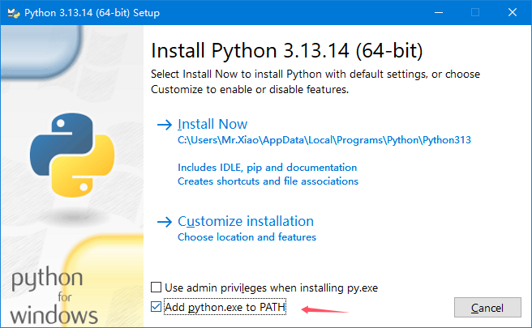

# 环境搭建

在开始学习 PyQt5 之前，我们需要先搭建好开发环境。本章介绍如何安装 Python 和 PyQt5，并验证安装是否成功。

---

## 1. 安装 Python

PyQt5 需要 Python 3.x 环境（推荐 Python 3.6 及以上版本）。

### 1.1 检查是否已安装 Python

打开命令提示符（按 `Win + R`，输入 `cmd`，回车），输入以下命令：

```bash
python --version
```

或者：

```bash
python3 --version
```

如果显示类似 `Python 3.x.x` 的版本号，说明 Python 已安装，可以跳过安装步骤，直接安装 PyQt5。




### 1.2 下载并安装 Python

如果未安装 Python，请按以下步骤操作：

1. 访问 Python 官网：[https://www.python.org/downloads/](https://www.python.org/downloads/)
2. 点击页面上的 **"Download Python 3.x.x"** 按钮下载最新版本




1. 运行下载的安装程序

**⚠️ 安装时的重要设置：**

- **务必勾选 "Add Python to PATH"**（将 Python 添加到环境变量，这一步非常重要！）
- 点击 **"Install Now"** 进行安装




2. 等待安装完成


### 1.3 验证 Python 安装

安装完成后，**重新打开**命令提示符（重要！），输入：

```bash
python --version
```

如果显示 Python 版本号，说明安装成功。

---

## 2. 安装 PyQt5

### 2.1 使用 pip 安装（推荐）

打开命令提示符，输入以下命令：

```bash
pip install PyQt5
```

等待安装完成即可。

**注意**：如果安装失败，请检查 Python 是否添加到环境变量。

### 2.2 安装 PyQt5 工具集

PyQt5 工具集包含了 Qt Designer 等实用工具：

```bash
pip install pyqt5-tools
```

### 2.3 验证 PyQt5 安装

创建一个测试文件 `test_pyqt5.py`：

```python
# -*- coding: utf-8 -*-
import sys
from PyQt5.QtWidgets import QApplication, QWidget

if __name__ == '__main__':
    app = QApplication(sys.argv)
    w = QWidget()
    w.setWindowTitle('PyQt5 安装成功')
    w.show()
    sys.exit(app.exec_())
```

运行这个文件，如果弹出一个窗口，说明 PyQt5 安装成功。

---

## 3. 安装开发工具

### 3.1 推荐编辑器

- **VS Code**（推荐）：轻量级，支持 Python 插件
- **PyCharm**：功能强大的 Python IDE
- **PyQt5 + Qt Designer**：可视化设计界面

### 3.2 VS Code 配置

1. 安装 VS Code：[https://code.visualstudio.com/](https://code.visualstudio.com/)
2. 安装 Python 插件
3. 打开项目文件夹即可开始开发

---

## 4. 常见问题

### 4.1 pip 命令找不到

**原因**：Python 未添加到 PATH

**解决方法**：
1. 重新运行 Python 安装程序
2. 勾选 "Add Python to PATH"
3. 重新打开命令提示符

### 4.2 安装 PyQt5 速度慢

**解决方法**：使用国内镜像源

```bash
pip install PyQt5 -i https://pypi.tuna.tsinghua.edu.cn/simple
```

### 4.3 导入 PyQt5 报错

**原因**：可能安装了多个 Python 版本

**解决方法**：
```bash
# 查看 Python 路径
where python

# 使用完整路径安装
C:\Python39\python.exe -m pip install PyQt5
```

---

## 5. PyQt5 模块简介

PyQt5 包含多个模块，常用的有：

| 模块名 | 功能 | 常用类 |
|--------|------|--------|
| `QtCore` | 核心非 GUI 功能 | QObject, QTimer, QThread, pyqtSignal |
| `QtGui` | GUI 组件和图形 | QIcon, QPixmap, QFont, QPainter |
| `QtWidgets` | 窗口部件 | QWidget, QPushButton, QLabel, QMainWindow |
| `QtSql` | 数据库支持 | QSqlDatabase, QSqlQuery, QSqlTableModel |

常用导入方式：

```python
# 方式1：导入整个模块
from PyQt5 import QtWidgets, QtCore, QtGui

# 方式2：导入特定类（推荐）
from PyQt5.QtWidgets import QApplication, QWidget, QPushButton
from PyQt5.QtCore import Qt, QTimer, pyqtSignal
from PyQt5.QtGui import QIcon, QPixmap
```

---

环境搭建完成后，下一章我们将创建第一个 PyQt5 程序，学习窗口、按钮和工具提示的基本用法。