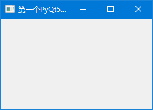
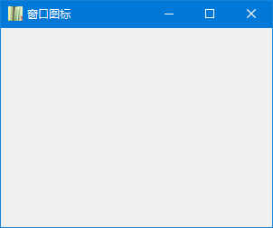
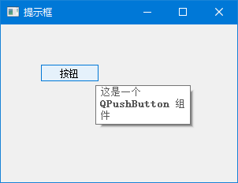
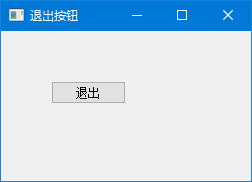
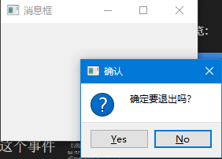
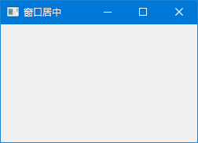

# 第一个PyQt5程序

学编程的第一件事是什么？当然是让程序跑起来，看到一个实实在在的窗口！

别担心，这比你想象的要简单得多。只需要 10 行代码，你就能在屏幕上弹出一个窗口。准备好了吗？开始吧！

---

## 1. 简单的窗口

先来看一段完整的代码，直接复制运行就能看到效果：

```python
# -*- coding: utf-8 -*-

import sys
from PyQt5.QtWidgets import QApplication, QWidget


if __name__ == '__main__':

    app = QApplication(sys.argv)

    w = QWidget()
    w.resize(250, 150)
    w.move(300, 300)
    w.setWindowTitle('第一个PyQt5程序')
    w.show()

    sys.exit(app.exec_())
```

运行之后，你会看到屏幕上弹出一个小窗口，就像这样：




是不是很简单？别急着往下翻，**先把这段代码跑起来**，看到窗口弹出来的那一刻，你会有种"我也能写软件"的成就感！

---

### 逐行拆解

现在我们来搞清楚每一行代码在干什么。

```python
import sys
from PyQt5.QtWidgets import QApplication, QWidget
```

这两行是在"拿工具"。`QApplication` 是创建应用必须的，`QWidget` 是最基础的窗口控件。就像做饭前要先把锅碗瓢盆拿出来一样。

```python
app = QApplication(sys.argv)
```

**这行非常重要！** 每个 PyQt5 程序都必须有且只有一个 `QApplication` 对象。

你可能会问：`sys.argv` 是什么？简单说，它是命令行传进来的参数。比如你在命令行输入 `python main.py --debug`，`sys.argv` 就是 `['main.py', '--debug']`。虽然我们暂时用不到，但 PyQt5 要求必须传给它，照做就行。

> 💡 **记住**：先创建 `QApplication`，再创建其他控件，顺序不能反！

```python
w = QWidget()
```

`QWidget` 是所有控件的"老祖宗"。按钮、标签、输入框……全都是它的子孙。

一个没有"爸爸"的 `QWidget`，就是一个独立的窗口。给它指定"爸爸"后，它就变成爸爸的一部分了（这个后面会细说）。

```python
w.resize(250, 150)
```

设置窗口大小：宽 250 像素，高 150 像素。

> 🎮 **动手试试**：把数字改成 `resize(500, 300)`，看看窗口变多大？

```python
w.move(300, 300)
```

把窗口放到屏幕坐标 (300, 300) 的位置。

屏幕坐标系的原点 (0, 0) 在**左上角**，x 向右增大，y 向下增大。这和我们数学课学的坐标系不太一样，注意别搞混了。

```python
w.setWindowTitle('简单窗口')
```

设置窗口标题，就是显示在标题栏上的文字。

```python
w.show()
```

让窗口显示出来。

你可能觉得奇怪：创建窗口不就应该显示吗？但在 PyQt5 里，控件创建后只是"存在内存里"，必须调用 `show()` 才会真正画到屏幕上。

> ⚠️ **常见错误**：忘了写 `show()`，程序能运行但看不到窗口，新手经常踩这个坑！

```python
sys.exit(app.exec_())
```

这行代码让程序进入"主循环"。

什么是主循环？想象一下餐厅的服务员：
- 他站在大厅里，等着客人叫他（**监听事件**）
- 客人说"点菜"，他就去记单（**处理事件**）
- 客人说"买单走人"，他就下班（**退出循环**）

`app.exec_()` 就是让程序进入这个"等待-处理"的循环。那个下划线是因为 `exec` 是 Python 的关键字，所以 PyQt5 加了个下划线避开冲突。

---

## 2. 带窗口图标

光秃秃的窗口不太好看，我们给它加个图标吧。

窗口图标就是显示在左上角、标题栏最左边的那个小图片。

```python
# -*- coding: utf-8 -*-

import sys
from PyQt5.QtWidgets import QApplication, QWidget
from PyQt5.QtGui import QIcon


class Example(QWidget):

    def __init__(self):
        super().__init__()

        self.initUI()


    def initUI(self):

        self.setGeometry(300, 300, 300, 220)
        self.setWindowTitle('窗口图标')
        self.setWindowIcon(QIcon('web.png'))        

        self.show()


if __name__ == '__main__':

    app = QApplication(sys.argv)
    ex = Example()
    sys.exit(app.exec_())
```

这次我们用了**面向对象**的写法。和上一个例子的"流水账"式写法不同，我们把代码组织成了一个类。

### 为什么要用类？

第一个例子只有十几行代码，怎么写都行。但实际项目动辄几百上千行，如果全堆在一起，维护起来简直是噩梦。

用类的好处是：
- **结构清晰**：`initUI()` 专门负责界面，其他方法负责逻辑
- **方便扩展**：要加新功能，直接在类里加方法就行
- **代码复用**：这个窗口类可以在其他地方重复使用

```python
class Example(QWidget):

    def __init__(self):
        super().__init__()

        self.initUI()
```

这三行是固定套路：
1. 继承 `QWidget`，让 `Example` 成为一个窗口
2. `super().__init__()` 调用父类的初始化方法
3. `self.initUI()` 调用我们自己写的界面初始化方法

> 📌 **记住**：以后写 PyQt5 程序，基本都用这种面向结构，这个模板要记牢！

```python
self.setGeometry(300, 300, 300, 220)
```

这个方法相当于 `move()` + `resize()` 的合体：
- 前两个参数 (300, 300) 是窗口位置
- 后两个参数 (300, 220) 是窗口大小

```python
self.setWindowIcon(QIcon('web.png'))
```

设置窗口图标。`QIcon` 接收一个图片路径。

> ⚠️ **注意**：这里的 `'web.png'` 需要和 Python 文件在同一个目录下，否则会找不到图片，图标就显示不出来。

程序预览：




---

## 3. 提示框

```python
# -*- coding: utf-8 -*-

import sys
from PyQt5.QtWidgets import (QWidget, QToolTip, 
    QPushButton, QApplication)
from PyQt5.QtGui import QFont    


class Example(QWidget):

    def __init__(self):
        super().__init__()

        self.initUI()


    def initUI(self):

        QToolTip.setFont(QFont('SansSerif', 10))

        self.setToolTip('这是一个 <b>QWidget</b> 组件')

        btn = QPushButton('按钮', self)
        btn.setToolTip('这是一个 <b>QPushButton</b> 组件')
        btn.resize(btn.sizeHint())
        btn.move(50, 50)       

        self.setGeometry(300, 300, 300, 200)
        self.setWindowTitle('提示框')    
        self.show()


if __name__ == '__main__':

    app = QApplication(sys.argv)
    ex = Example()
    sys.exit(app.exec_())
```

在这个例子中，我们为 QWidget 和 QPushButton 设置了提示框。

```text
QToolTip.setFont(QFont('SansSerif', 10))
```

通过静态方法 `setFont()` 设置提示框的字体，这里使用了 10px 的 SansSerif 字体。

```text
self.setToolTip('这是一个 <b>QWidget</b> 组件')
```

我们为这个控件创建了提示框，使用了 `setToolTip()` 方法。

```text
btn = QPushButton('按钮', self)
btn.setToolTip('这是一个 <b>QPushButton</b> 组件')
```

为按钮设置提示框。

```text
btn.resize(btn.sizeHint())
```

`resize()` 方法改变了控件的大小。`sizeHint()` 返回按钮的推荐大小。

程序预览：




---

## 4. 关闭窗口按钮

```python
# -*- coding: utf-8 -*-

import sys
from PyQt5.QtWidgets import QWidget, QPushButton, QApplication
from PyQt5.QtCore import QCoreApplication


class Example(QWidget):

    def __init__(self):
        super().__init__()

        self.initUI()


    def initUI(self):               

        qbtn = QPushButton('退出', self)
        qbtn.clicked.connect(QCoreApplication.instance().quit)
        qbtn.resize(qbtn.sizeHint())
        qbtn.move(50, 50)       

        self.setGeometry(300, 300, 250, 150)
        self.setWindowTitle('退出按钮')    
        self.show()


if __name__ == '__main__':

    app = QApplication(sys.argv)
    ex = Example()
    sys.exit(app.exec_())
```

```text
qbtn.clicked.connect(QCoreApplication.instance().quit)
```

信号与槽机制：`clicked` 是信号，`quit` 是槽。点击按钮时触发信号，调用槽函数关闭应用。

程序预览：




---

## 5. 消息框

默认情况下，如果我们点击标题栏的 X 按钮，QWidget 会关闭。有时候我们希望修改这个默认行为。例如，我们显示一个消息框确认是否真的要关闭。

```python
# -*- coding: utf-8 -*-

import sys
from PyQt5.QtWidgets import QWidget, QMessageBox, QApplication


class Example(QWidget):

    def __init__(self):
        super().__init__()

        self.initUI()


    def initUI(self):               

        self.setGeometry(300, 300, 250, 150)        
        self.setWindowTitle('消息框')    
        self.show()


    def closeEvent(self, event):

        reply = QMessageBox.question(self, '确认', 
            '确定要退出吗？', QMessageBox.Yes | 
            QMessageBox.No, QMessageBox.No)

        if reply == QMessageBox.Yes:
            event.accept()
        else:
            event.ignore()        


if __name__ == '__main__':

    app = QApplication(sys.argv)
    ex = Example()
    sys.exit(app.exec_())
```

如果我们关闭 QWidget，QCloseEvent 类事件会被生成。修改组件的行为，我们需要重写 `closeEvent()` 事件处理器。

```text
reply = QMessageBox.question(self, '确认', 
    '确定要退出吗？', QMessageBox.Yes | 
    QMessageBox.No, QMessageBox.No)
```

我们弹出一个消息框，有两个按钮：Yes 和 No。第一个字符串 '确认' 显示在标题栏。第二个字符串是对话框的提示信息。第三个参数指定了按钮的组合。最后一个参数是默认按钮。

```text
if reply == QMessageBox.Yes:
    event.accept()
else:
    event.ignore()
```

这里我们判断返回值。如果点击 Yes 按钮，我们接受这个事件关闭窗口。否则忽略关闭事件。

程序预览：




---

## 6. 窗口居中显示

```python
# -*- coding: utf-8 -*-

import sys
from PyQt5.QtWidgets import QWidget, QDesktopWidget, QApplication


class Example(QWidget):

    def __init__(self):
        super().__init__()

        self.initUI()


    def initUI(self):               

        self.resize(250, 150)
        self.center()
        self.setWindowTitle('窗口居中')    
        self.show()


    def center(self):

        qr = self.frameGeometry()
        cp = QDesktopWidget().availableGeometry().center()
        qr.moveCenter(cp)
        self.move(qr.topLeft())


if __name__ == '__main__':

    app = QApplication(sys.argv)
    ex = Example()
    sys.exit(app.exec_())
```

```text
qr = self.frameGeometry()
```

获取主窗口的矩形框架（绝对位置，大小）。

```text
cp = QDesktopWidget().availableGeometry().center()
```

计算屏幕分辨率的中心点。

```text
qr.moveCenter(cp)
```

把矩形的中心移动到屏幕的中心。

```text
self.move(qr.topLeft())
```

把窗口的左上角移动到 qr 矩形的左上角，这样窗口就位于屏幕中心了。

程序预览：




---

## 7. PyQt5 程序基本结构

通过上面的例子，我们可以总结出 PyQt5 程序的基本结构：

```python
# -*- coding: utf-8 -*-
import sys
from PyQt5.QtWidgets import QApplication, QWidget

class MainWindow(QWidget):
    def __init__(self):
        super().__init__()
        self.initUI()
    
    def initUI(self):
        # 1. 设置窗口属性
        self.setWindowTitle('窗口标题')
        self.setGeometry(300, 300, 300, 200)
        
        # 2. 添加控件
        # ...
        
        # 3. 显示窗口
        self.show()

if __name__ == '__main__':
    # 1. 创建应用程序对象
    app = QApplication(sys.argv)
    
    # 2. 创建主窗口
    window = MainWindow()
    
    # 3. 进入主循环
    sys.exit(app.exec_())
```

**程序执行流程**：
1. 创建 QApplication 对象
2. 创建主窗口对象
3. 调用 show() 显示窗口
4. 进入 app.exec_() 主循环
5. 主循环监听事件并分发处理
6. 关闭窗口时退出主循环

---

## 💡 学习笔记

> 这里记录一些我学习时踩过的坑和心得体会，希望能帮你少走弯路。

### 1. 忘了写 `show()` 是最常见的错误

我第一次写 PyQt5 的时候，代码跑起来啥都没有，检查了半天才发现忘了写 `w.show()`。这个坑几乎每个新手都会踩，记住就行。

### 2. `sys.argv` 不用深究

很多教程会详细解释 `sys.argv`，但其实你只需要知道"PyQt5 要求必须传"就行。等你需要处理命令行参数的时候，自然就知道怎么用了。

### 3. 面向对象的写法一开始不习惯很正常

第一个例子用"流水账"写法完全没问题，但第二个例子突然变成类的写法，很多人会懵。我的建议是：**先照着写，写多了就习惯了**。这个模板以后每个程序都会用。

### 4. 图片路径问题

`QIcon('web.png')` 这里的图片路径是相对于 Python 文件的。如果图片和 Python 文件不在同一个目录，需要写完整路径。建议把图片放在和代码同一个文件夹里。

---

本章我们学习了 PyQt5 程序的基本结构和常用功能。下一章深入了解 PyQt5 的核心概念，包括模块结构、程序架构和信号与槽机制。