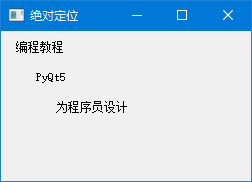
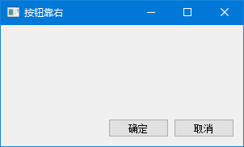
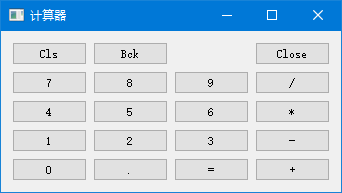

# 布局管理

你有没有遇到过这种情况：代码里写好的界面，窗口一拉伸，按钮全挤在一起了？或者换个分辨率，控件全跑偏了？

这就是**布局管理**要解决的问题。

PyQt5 提供了多种布局方式，从最简单的"绝对定位"到灵活的"自适应布局"，我们一个一个来。

---

## 1. 绝对定位

### 1.1 最直观的方式

绝对定位就是直接告诉控件："你待在坐标 (x, y) 的位置，别动。"

```python
# -*- coding: utf-8 -*-

import sys
from PyQt5.QtWidgets import QWidget, QLabel, QApplication

class Example(QWidget):

    def __init__(self):
        super().__init__()

        self.initUI()


    def initUI(self):

        lbl1 = QLabel('编程教程', self)
        lbl1.move(15, 10)

        lbl2 = QLabel('PyQt5', self)
        lbl2.move(35, 40)

        lbl3 = QLabel('为程序员设计', self)
        lbl3.move(55, 70)        

        self.setGeometry(300, 300, 250, 150)
        self.setWindowTitle('绝对定位')    
        self.show()


if __name__ == '__main__':

    app = QApplication(sys.argv)
    ex = Example()
    sys.exit(app.exec_())
```

程序展示：




### 1.2 为什么不推荐？

绝对定位看起来很直观，但有几个致命问题：

| 问题 | 说明 |
|------|------|
| 窗口拉伸时 | 控件不会跟着动，留出一大片空白 |
| 不同分辨率 | 在小屏幕上可能显示不全 |
| 不同系统 | Windows 和 macOS 字体大小不同，控件可能重叠 |
| 维护困难 | 改一个控件的位置，后面的都要跟着调 |

> 💡 **结论**：绝对定位只适合做 demo 或者固定大小的窗口。正经项目别用。

---

## 2. 盒布局

### 2.1 什么是盒布局？

盒布局就像**排队**：
- `QHBoxLayout`：水平排队（从左到右）
- `QVBoxLayout`：垂直排队（从上到下）

窗口变大时，队列会自动拉伸，控件不会挤在一起。

### 2.2 例子：按钮靠右

这是最常见的布局场景：对话框底部的"确定"和"取消"按钮靠右对齐。

```python
# -*- coding: utf-8 -*-

import sys
from PyQt5.QtWidgets import (QWidget, QPushButton, 
    QHBoxLayout, QVBoxLayout, QApplication)


class Example(QWidget):

    def __init__(self):
        super().__init__()

        self.initUI()


    def initUI(self):

        okButton = QPushButton("确定")
        cancelButton = QPushButton("取消")

        # 水平布局：放两个按钮
        hbox = QHBoxLayout()
        hbox.addStretch(1)  # 添加弹性空间
        hbox.addWidget(okButton)
        hbox.addWidget(cancelButton)

        # 垂直布局：把水平布局塞到底部
        vbox = QVBoxLayout()
        vbox.addStretch(1)  # 添加弹性空间
        vbox.addLayout(hbox)

        self.setLayout(vbox)    

        self.setGeometry(300, 300, 300, 150)
        self.setWindowTitle('按钮靠右')    
        self.show()


if __name__ == '__main__':

    app = QApplication(sys.argv)
    ex = Example()
    sys.exit(app.exec_())
```

程序展示：




### 2.3 核心代码拆解

```python
hbox = QHBoxLayout()
hbox.addStretch(1)
hbox.addWidget(okButton)
hbox.addWidget(cancelButton)
```

这就像排队：

```
[弹性空间（自动变大）] [确定] [取消]
 ←—————— 占满剩余空间 ——————→
```

`addStretch(1)` 添加了一个**弹性空间**，它会自动占据所有剩余空间，把按钮推到右边。

> 🎮 **动手试试**：把 `addStretch(1)` 删掉，看看按钮跑到哪去了？

```python
vbox = QVBoxLayout()
vbox.addStretch(1)
vbox.addLayout(hbox)
```

垂直布局也加了一个弹性空间，把按钮行推到窗口底部。

### 2.4 addStretch 的参数是什么意思？

```python
hbox.addStretch(1)  # 弹性因子为 1
hbox.addStretch(2)  # 弹性因子为 2
```

弹性因子决定了"谁能占更多空间"：

```
addStretch(1) + 按钮 + addStretch(2)

结果：左边占 1/3，右边占 2/3
[——1份——] [按钮] [——2份——]
```

---

## 3. 栅格布局

### 3.1 什么是栅格布局？

栅格布局就是把窗口划分成**行和列**，像 Excel 表格一样。每个控件占据一个格子。

```
┌──────┬──────┬──────┬──────┐
│ Cls  │ Bck  │      │ Close│  ← 第0行
├──────┼──────┼──────┼──────┤
│  7   │  8   │  9   │  /   │  ← 第1行
├──────┼──────┼──────┼──────┤
│  4   │  5   │  6   │  *   │  ← 第2行
├──────┼──────┼──────┼──────┤
│  1   │  2   │  3   │  -   │  ← 第3行
├──────┼──────┼──────┼──────┤
│  0   │  .   │  =   │  +   │  ← 第4行
└──────┴──────┴──────┴──────┘
  列0    列1    列2    列3
```

### 3.2 例子：计算器界面

```python
# -*- coding: utf-8 -*-

import sys
from PyQt5.QtWidgets import (QWidget, QGridLayout, 
    QPushButton, QApplication)


class Example(QWidget):

    def __init__(self):
        super().__init__()

        self.initUI()


    def initUI(self):

        grid = QGridLayout()
        self.setLayout(grid)

        names = ['Cls', 'Bck', '', 'Close',
                 '7', '8', '9', '/',
                 '4', '5', '6', '*',
                 '1', '2', '3', '-',
                 '0', '.', '=', '+']

        positions = [(i,j) for i in range(5) for j in range(4)]

        for position, name in zip(positions, names):

            if name == '':
                continue
            button = QPushButton(name)
            grid.addWidget(button, *position)

        self.move(300, 150)
        self.setWindowTitle('计算器')
        self.show()


if __name__ == '__main__':

    app = QApplication(sys.argv)
    ex = Example()
    sys.exit(app.exec_())
```

程序展示：




### 3.3 核心代码

```python
grid = QGridLayout()
self.setLayout(grid)
```

创建栅格布局并设置为窗口的布局。

```python
positions = [(i,j) for i in range(5) for j in range(4)]
```

生成所有格子的位置：`(0,0), (0,1), (0,2), (0,3), (1,0), (1,1)...`

```python
for position, name in zip(positions, names):
    if name == '':
        continue
    button = QPushButton(name)
    grid.addWidget(button, *position)
```

遍历每个位置和对应的按钮名称，把按钮放到格子里。空字符串就跳过（那个空白格子）。

```python
grid.addWidget(button, *position)
```

`*position` 是把元组 `(i, j)` 展开成两个参数，等价于 `grid.addWidget(button, i, j)`。

---

## 4. 表单布局

### 4.1 什么是表单布局？

表单布局专门用来做"标签 + 输入框"这种成对出现的界面，比如注册表单、设置页面。

```
姓名：   [____________]
邮箱：   [____________]
年龄：   [____________]
```

### 4.2 例子：注册表单

```python
# -*- coding: utf-8 -*-

import sys
from PyQt5.QtWidgets import (QWidget, QFormLayout, 
    QLabel, QLineEdit, QApplication)


class Example(QWidget):

    def __init__(self):
        super().__init__()

        self.initUI()


    def initUI(self):

        form = QFormLayout()

        nameLabel = QLabel("姓名")
        nameEdit = QLineEdit()
        form.addRow(nameLabel, nameEdit)

        emailLabel = QLabel("邮箱")
        emailEdit = QLineEdit()
        form.addRow(emailLabel, emailEdit)

        ageLabel = QLabel("年龄")
        ageEdit = QLineEdit()
        form.addRow(ageLabel, ageEdit)

        self.setLayout(form)

        self.setWindowTitle('表单布局')
        self.show()


if __name__ == '__main__':

    app = QApplication(sys.argv)
    ex = Example()
    sys.exit(app.exec_())
```

### 4.3 核心代码

```python
form.addRow(nameLabel, nameEdit)
```

一行搞定"标签 + 输入框"的对齐。表单布局会自动把标签右对齐、输入框左对齐，看起来整整齐齐。

> 💡 **小贴士**：表单布局也可以这样写，更简洁：
> ```python
> form.addRow("姓名", QLineEdit())
> form.addRow("邮箱", QLineEdit())
> ```

---

## 5. 布局嵌套实战

### 5.1 为什么要嵌套？

现实中的界面很少只用一种布局。通常是**大布局套小布局**，像搭积木一样。

```
垂直布局（主布局）
├── 水平布局（标题栏）
│   ├── 返回按钮  ├── 标题  ├── 设置按钮
├── 栅格布局（内容区）
│   ├── 用户名    ├── 昵称
│   ├── 密码      ├── 确认密码
│   └── 邮箱（跨3列）
├── 表单布局（高级设置）
│   ├── 用户类型: [下拉框]
│   └── 选项: ☑订阅新闻 ☐接收通知
└── 水平布局（按钮区）
    └── [弹性空间] [取消] [确定]
```

### 5.2 完整示例：用户注册界面

```python
# -*- coding: utf-8 -*-
import sys
from PyQt5.QtWidgets import (QApplication, QWidget, QVBoxLayout, QHBoxLayout,
                             QGridLayout, QFormLayout, QLabel, QLineEdit,
                             QPushButton, QComboBox, QCheckBox, QGroupBox)
from PyQt5.QtCore import Qt


class NestedLayoutDemo(QWidget):
    def __init__(self):
        super().__init__()
        self.initUI()
    
    def initUI(self):
        self.setWindowTitle('嵌套布局示例')
        self.setGeometry(300, 300, 500, 400)
        
        # 主垂直布局
        main_layout = QVBoxLayout()
        main_layout.setSpacing(15)  # 控件间距
        main_layout.setContentsMargins(20, 20, 20, 20)  # 边距
        
        # 1. 顶部标题栏
        header_layout = self.create_header()
        main_layout.addLayout(header_layout)
        
        # 2. 中间内容区
        content_group = self.create_content_area()
        main_layout.addWidget(content_group)
        
        # 3. 配置区
        config_group = self.create_config_area()
        main_layout.addWidget(config_group)
        
        # 弹性空间（把按钮推到底部）
        main_layout.addStretch()
        
        # 4. 底部按钮
        button_layout = self.create_buttons()
        main_layout.addLayout(button_layout)
        
        self.setLayout(main_layout)
    
    def create_header(self):
        """标题栏：水平布局"""
        layout = QHBoxLayout()
        
        back_btn = QPushButton('← 返回')
        back_btn.setFixedWidth(80)
        layout.addWidget(back_btn)
        
        title = QLabel('用户注册')
        title.setAlignment(Qt.AlignCenter)
        title.setStyleSheet('font-size: 18px; font-weight: bold;')
        layout.addWidget(title, 1)  # 拉伸因子为1，占满剩余空间
        
        settings_btn = QPushButton('⚙')
        settings_btn.setFixedSize(30, 30)
        layout.addWidget(settings_btn)
        
        return layout
    
    def create_content_area(self):
        """内容区：栅格布局"""
        group = QGroupBox('基本信息')
        layout = QGridLayout()
        layout.setSpacing(10)
        
        # 第一行：用户名、昵称
        layout.addWidget(QLabel('用户名:'), 0, 0)
        self.username = QLineEdit()
        self.username.setPlaceholderText('请输入用户名')
        layout.addWidget(self.username, 0, 1)
        
        layout.addWidget(QLabel('昵称:'), 0, 2)
        self.nickname = QLineEdit()
        self.nickname.setPlaceholderText('请输入昵称')
        layout.addWidget(self.nickname, 0, 3)
        
        # 第二行：密码、确认密码
        layout.addWidget(QLabel('密码:'), 1, 0)
        self.password = QLineEdit()
        self.password.setEchoMode(QLineEdit.Password)
        layout.addWidget(self.password, 1, 1)
        
        layout.addWidget(QLabel('确认密码:'), 1, 2)
        self.confirm_pwd = QLineEdit()
        self.confirm_pwd.setEchoMode(QLineEdit.Password)
        layout.addWidget(self.confirm_pwd, 1, 3)
        
        # 第三行：邮箱（跨3列）
        layout.addWidget(QLabel('邮箱:'), 2, 0)
        self.email = QLineEdit()
        self.email.setPlaceholderText('请输入邮箱')
        layout.addWidget(self.email, 2, 1, 1, 3)  # 从(2,1)开始，跨1行3列
        
        group.setLayout(layout)
        return group
    
    def create_config_area(self):
        """配置区：表单布局"""
        group = QGroupBox('高级设置')
        layout = QFormLayout()
        layout.setSpacing(10)
        
        self.user_type = QComboBox()
        self.user_type.addItems(['普通用户', 'VIP用户', '管理员'])
        layout.addRow('用户类型:', self.user_type)
        
        self.department = QComboBox()
        self.department.addItems(['技术部', '产品部', '运营部', '市场部'])
        layout.addRow('所属部门:', self.department)
        
        # 选项行（水平布局嵌套在表单里）
        options_layout = QHBoxLayout()
        self.newsletter = QCheckBox('订阅新闻')
        self.notification = QCheckBox('接收通知')
        self.newsletter.setChecked(True)
        options_layout.addWidget(self.newsletter)
        options_layout.addWidget(self.notification)
        options_layout.addStretch()
        layout.addRow('选项:', options_layout)
        
        group.setLayout(layout)
        return group
    
    def create_buttons(self):
        """按钮区：水平布局"""
        layout = QHBoxLayout()
        layout.addStretch()  # 弹性空间，把按钮推到右边
        
        cancel_btn = QPushButton('取消')
        cancel_btn.setFixedWidth(100)
        cancel_btn.clicked.connect(self.close)
        layout.addWidget(cancel_btn)
        
        ok_btn = QPushButton('确定')
        ok_btn.setFixedWidth(100)
        ok_btn.setStyleSheet('background-color: #4CAF50; color: white;')
        ok_btn.clicked.connect(self.on_submit)
        layout.addWidget(ok_btn)
        
        return layout
    
    def on_submit(self):
        print('提交表单:')
        print(f'  用户名: {self.username.text()}')
        print(f'  昵称: {self.nickname.text()}')
        print(f'  邮箱: {self.email.text()}')


if __name__ == '__main__':
    app = QApplication(sys.argv)
    window = NestedLayoutDemo()
    window.show()
    sys.exit(app.exec_())
```

> 🎮 **动手试试**：运行程序，拉伸窗口，看看界面是不是自适应的？

---

## 6. 布局方法速查

| 方法 | 说明 |
|------|------|
| `addWidget(widget)` | 添加控件 |
| `addLayout(layout)` | 添加子布局（嵌套用这个） |
| `addStretch(factor)` | 添加弹性空间 |
| `setSpacing(n)` | 设置控件间距 |
| `setContentsMargins(l, t, r, b)` | 设置边距（左、上、右、下） |
| `setAlignment(widget, alignment)` | 设置对齐方式 |

---

## 7. 四种布局对比

| 布局 | 适合场景 | 优点 | 缺点 |
|------|---------|------|------|
| 绝对定位 | 固定大小的 demo | 精确控制 | 窗口拉伸就乱套 |
| 盒布局 | 按钮行、垂直排列 | 简单灵活 | 复杂界面需要嵌套 |
| 栅格布局 | 计算器、键盘、网格 | 行列清晰 | 跨行跨列要算坐标 |
| 表单布局 | 注册表单、设置页 | 标签自动对齐 | 只适合"标签+输入框" |

> 💡 **一句话总结**：盒布局最常用，栅格布局做网格，表单布局做表单，绝对定位……尽量别用。

---

掌握布局管理后，我们就可以创建出美观、自适应的界面了。下一章学习对话框的使用，用于与用户进行各种交互。