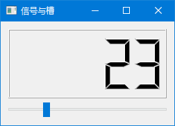
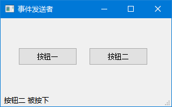
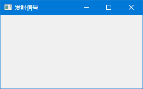

# 事件和信号

你有没有想过：点击按钮后，程序是怎么知道要做什么的？拖动窗口时，界面是怎么跟着移动的？

答案就是**事件和信号**。这是 PyQt5 的"神经系统"，没有它，程序就是个不会动的木头人。

---

## 1. 信号与槽

### 1.1 先来个直观的

想象你去餐厅吃饭的场景：

```
你举手喊"服务员" → 服务员听到后走过来 → 帮你点菜
     ↑                      ↑                    ↑
   发信号                信号传递              执行操作
```

在 PyQt5 里，这个过程叫**信号与槽**：
- **信号（Signal）**：你举手喊人，告诉外界"我有需求"
- **槽（Slot）**：服务员听到后的响应动作
- **连接（Connect）**：你和服务员之间的"沟通渠道"

来看个实际例子：拖动滑块，数字跟着变。

```python
# -*- coding: utf-8 -*-

import sys
from PyQt5.QtWidgets import (QWidget, QLCDNumber, QSlider, 
    QVBoxLayout, QApplication)
from PyQt5.QtCore import Qt


class Example(QWidget):

    def __init__(self):
        super().__init__()

        self.initUI()


    def initUI(self):

        lcd = QLCDNumber(self)
        sld = QSlider(Qt.Horizontal, self)

        vbox = QVBoxLayout()
        vbox.addWidget(lcd)
        vbox.addWidget(sld)

        self.setLayout(vbox)
        sld.valueChanged.connect(lcd.display)

        self.setGeometry(300, 300, 250, 150)
        self.setWindowTitle('信号与槽')
        self.show()


if __name__ == '__main__':

    app = QApplication(sys.argv)
    ex = Example()
    sys.exit(app.exec_())
```

程序预览：



> 🎮 **动手试试**：拖动滑块，看看 LCD 数字是不是跟着变了？

### 1.2 核心代码就一行

```python
sld.valueChanged.connect(lcd.display)
```

翻译成人话：
> "当滑块的值改变时（`valueChanged`），让 LCD 显示这个值（`display`）"

- `valueChanged` 是滑块发出的**信号**："我的值变了！"
- `display` 是 LCD 的**槽函数**："收到，我来显示"
- `connect()` 把它们绑在一起

> 💡 **一句话理解**：信号是"喊话"，槽是"回应"，connect 是"牵线搭桥"。

---

## 2. 重写事件处理器

### 2.1 什么是事件处理器？

事件处理器就是程序对某些操作的"本能反应"。比如：
- 点击按钮 → 按钮"本能地"凹下去
- 按键盘 → 输入框"本能地"显示字符
- 关闭窗口 → 程序"本能地"退出

但有时候，默认的"本能反应"不够用，我们需要**自定义**。

### 2.2 例子：按 Esc 键退出

```python
# -*- coding: utf-8 -*-

import sys
from PyQt5.QtCore import Qt
from PyQt5.QtWidgets import QWidget, QApplication


class Example(QWidget):

    def __init__(self):
        super().__init__()

        self.initUI()


    def initUI(self):      

        self.setGeometry(300, 300, 250, 150)
        self.setWindowTitle('事件处理器')    
        self.show()


    def keyPressEvent(self, e):

        if e.key() == Qt.Key_Escape:
            self.close()


if __name__ == '__main__':

    app = QApplication(sys.argv)
    ex = Example()
    sys.exit(app.exec_())
```

这段代码做了什么？

```python
def keyPressEvent(self, e):

    if e.key() == Qt.Key_Escape:
        self.close()
```

我们**重写**了 `keyPressEvent()` 方法。这个方法原本是 PyQt5 内置的，专门处理键盘按键。我们把它"劫持"过来，改成自己的逻辑：

> "如果有人按了 Esc 键，我就关闭窗口"

> 🎮 **动手试试**：运行程序，按下 Esc 键，看看窗口是不是关掉了？

### 2.3 常见的事件处理器

| 方法名 | 什么时候触发 |
|--------|-------------|
| `mousePressEvent()` | 鼠标按下 |
| `mouseReleaseEvent()` | 鼠标松开 |
| `mouseMoveEvent()` | 鼠标移动 |
| `keyPressEvent()` | 键盘按下 |
| `keyReleaseEvent()` | 键盘松开 |
| `closeEvent()` | 窗口关闭 |
| `resizeEvent()` | 窗口大小改变 |

---

## 3. 事件发送者

### 3.1 谁在喊话？

有时候，多个按钮共用同一个处理函数，我们怎么知道是哪个按钮被点了？

就像你同时管理好几个微信群，有人发消息，你得知道是哪个群发的。

```python
# -*- coding: utf-8 -*-

import sys
from PyQt5.QtWidgets import QMainWindow, QPushButton, QApplication


class Example(QMainWindow):

    def __init__(self):
        super().__init__()

        self.initUI()


    def initUI(self):      

        btn1 = QPushButton("按钮一", self)
        btn1.move(30, 50)

        btn2 = QPushButton("按钮二", self)
        btn2.move(150, 50)

        # 两个按钮共用同一个处理函数
        btn1.clicked.connect(self.buttonClicked)
        btn2.clicked.connect(self.buttonClicked)

        self.statusBar()

        self.setGeometry(300, 300, 290, 150)
        self.setWindowTitle('事件发送者')
        self.show()


    def buttonClicked(self):

        # 关键：找出是谁触发的
        sender = self.sender()
        self.statusBar().showMessage(sender.text() + ' 被按下')


if __name__ == '__main__':

    app = QApplication(sys.argv)
    ex = Example()
    sys.exit(app.exec_())
```

程序预览：




### 2.2 核心代码

```python
sender = self.sender()
```

`sender()` 方法会返回触发当前信号的那个控件。拿到它之后，你就可以：
- 获取按钮文字：`sender.text()`
- 获取按钮对象：直接操作 `sender`

> 💡 **使用场景**：多个按钮共用一个处理函数时，用 `sender()` 区分是谁触发的。

---

## 4. 自定义信号

### 4.1 为什么要自定义信号？

PyQt5 内置了很多信号（点击、改变、选中……），但有时候不够用。比如你想实现：

> "当数据处理完成后，通知界面更新"

这种场景就需要自己定义信号。

### 4.2 例子：点击鼠标关闭窗口

```python
# -*- coding: utf-8 -*-

import sys
from PyQt5.QtCore import pyqtSignal, QObject
from PyQt5.QtWidgets import QMainWindow, QApplication


class Communicate(QObject):

    # 定义一个自定义信号，名字叫 closeApp
    closeApp = pyqtSignal() 


class Example(QMainWindow):

    def __init__(self):
        super().__init__()

        self.initUI()


    def initUI(self):      

        # 创建 Communicate 对象
        self.c = Communicate()
        
        # 把我的自定义信号连接到窗口的 close() 方法
        self.c.closeApp.connect(self.close)       

        self.setGeometry(300, 300, 290, 150)
        self.setWindowTitle('发射信号')
        self.show()


    def mousePressEvent(self, event):

        # 鼠标点击时，发射信号
        self.c.closeApp.emit()


if __name__ == '__main__':

    app = QApplication(sys.argv)
    ex = Example()
    sys.exit(app.exec_())
```

程序预览：




### 4.3 拆解一下

**第一步：定义信号**

```python
class Communicate(QObject):
    closeApp = pyqtSignal()
```

创建一个类，里面定义一个信号 `closeApp`。`pyqtSignal()` 告诉 PyQt5："这是个信号，不是普通变量"。

**第二步：连接信号**

```python
self.c = Communicate()
self.c.closeApp.connect(self.close)
```

把自定义的信号连接到窗口的 `close()` 方法。

**第三步：发射信号**

```python
def mousePressEvent(self, event):
    self.c.closeApp.emit()
```

鼠标点击时，调用 `emit()` 发射信号。信号发射后，所有连接到它的槽函数都会被执行。

> 💡 **一句话理解**：自定义信号就是创建一个"广播站"，你想什么时候广播、广播什么，都由你决定。

### 4.4 带参数的信号

信号还可以带参数，就像发短信可以附带内容：

```python
from PyQt5.QtCore import pyqtSignal

class MyWorker(QObject):
    # 定义带参数的信号
    progress = pyqtSignal(int)        # 发送整数（进度百分比）
    finished = pyqtSignal(str)        # 发送字符串（结果）
    error = pyqtSignal(str, int)      # 发送多个参数（错误信息+错误码）
    
    def do_work(self):
        # 发射信号
        self.progress.emit(50)        # 进度50%
        self.finished.emit('完成！')   # 发送结果
```

**第四步：响应信号（接收参数）**

响应带参数的信号和普通信号一样，用 `connect()` 连接即可。槽函数会自动接收信号传来的参数：

```python
# -*- coding: utf-8 -*-

import sys
from PyQt5.QtCore import pyqtSignal, QObject
from PyQt5.QtWidgets import QWidget, QLabel, QVBoxLayout, QApplication


class MyWorker(QObject):
    # 定义带参数的信号
    progress = pyqtSignal(int)        # 发送整数（进度百分比）
    finished = pyqtSignal(str)        # 发送字符串（结果）
    error = pyqtSignal(str, int)      # 发送多个参数（错误信息+错误码）
    
    def do_work(self):
        self.progress.emit(50)
        self.finished.emit('任务完成！')


class Example(QWidget):

    def __init__(self):
        super().__init__()
        self.initUI()

    def initUI(self):
        
        self.label = QLabel('等待开始...')
        
        vbox = QVBoxLayout()
        vbox.addWidget(self.label)
        self.setLayout(vbox)
        
        # 创建 Worker 对象
        self.worker = MyWorker()
        
        # 连接信号到槽函数（参数会自动传递）
        self.worker.progress.connect(self.on_progress)
        self.worker.finished.connect(self.on_finished)
        self.worker.error.connect(self.on_error)
        
        self.setGeometry(300, 300, 300, 100)
        self.setWindowTitle('响应带参数的信号')
        self.show()
        
        # 开始工作（会发射信号）
        self.worker.do_work()
    
    # 槽函数：接收 int 参数
    def on_progress(self, value):
        self.label.setText(f'进度: {value}%')
    
    # 槽函数：接收 str 参数
    def on_finished(self, result):
        self.label.setText(f'结果: {result}')
    
    # 槽函数：接收多个参数 (str, int)
    def on_error(self, message, code):
        self.label.setText(f'错误 {code}: {message}')


if __name__ == '__main__':
    app = QApplication(sys.argv)
    ex = Example()
    sys.exit(app.exec_())
```

**原理图解：**

```
信号发射:  self.worker.finished.emit('完成！')
                                    ↓
信号传递:  ('完成！')  ← 自动携带参数
                                    ↓
槽函数:    def on_finished(self, result):
               # result = '完成！'
```

**关键点总结：**

| 要素 | 说明 |
|------|------|
| 定义信号 | `pyqtSignal(int, str)` - 声明参数类型 |
| 发射信号 | `signal.emit(value1, value2)` - 传递实际参数 |
| 连接信号 | `signal.connect(slot_function)` - 自动传递参数 |
| 槽函数 | `def slot(self, param):` - 参数列表与信号定义一致 |

> 💡 **一句话理解**：槽函数的参数会自动接收信号传来的值，你只需要正常 `connect()` 就行，PyQt5 会自动配对。

---

## 5. 事件类型

PyQt5 里的事件种类很多，但常用的就这几种：

| 事件类型 | 什么时候触发 | 常见用途 |
|---------|-------------|---------|
| 鼠标事件 | 点击、移动、滚轮 | 拖拽、绘图、交互 |
| 键盘事件 | 按键、释放 | 快捷键、游戏控制 |
| 窗口事件 | 显示、隐藏、关闭 | 保存状态、确认退出 |
| 定时器事件 | 定时触发 | 倒计时、自动刷新 |
| 拖拽事件 | 拖放操作 | 文件导入、排序 |
| 绘制事件 | 窗口重绘 | 自定义绘图、动画 |

---

## 6. 事件过滤器

### 6.1 这是什么？

事件过滤器就像小区的保安，可以在事件到达目标之前**拦截**它。

```
事件发生 → 保安拦截 → 检查是否放行 → 到达目标控件
```

### 6.2 例子：拦截标签的鼠标点击

```python
# -*- coding: utf-8 -*-

import sys
from PyQt5.QtCore import QEvent
from PyQt5.QtWidgets import QApplication, QWidget, QLabel, QVBoxLayout


class Example(QWidget):

    def __init__(self):
        super().__init__()
        self.initUI()

    def initUI(self):
        self.label = QLabel('点击我', self)
        self.label.move(50, 50)
        
        # 给标签安装事件过滤器（保安上岗）
        self.label.installEventFilter(self)
        
        self.setWindowTitle('事件过滤器')
        self.resize(300, 200)
        self.show()

    def eventFilter(self, obj, event):
        # 保安检查：是不是标签的鼠标点击事件？
        if obj == self.label and event.type() == QEvent.MouseButtonPress:
            print('标签被点击了，但我把它拦截了！')
            return True  # 拦截事件，不让标签自己处理
        return super().eventFilter(obj, event)


if __name__ == '__main__':
    app = QApplication(sys.argv)
    ex = Example()
    sys.exit(app.exec_())
```

### 6.3 核心步骤

```python
# 1. 安装过滤器（让保安上岗）
self.label.installEventFilter(self)

# 2. 重写 eventFilter 方法（保安的工作流程）
def eventFilter(self, obj, event):
    if obj == self.label:  # 检查是不是我要监控的对象
        if event.type() == QEvent.MouseButtonPress:  # 检查是不是我要拦截的事件
            # 做你想做的事
            return True  # 返回 True = 拦截，返回 False = 放行
    return super().eventFilter(obj, event)
```

> 💡 **使用场景**：想在控件处理事件之前"插一脚"，就用事件过滤器。

---

## 7. 信号与槽的连接方式

### 7.1 基本连接

```python
# 连接到内置方法
button.clicked.connect(app.quit)

# 连接到自定义方法
button.clicked.connect(self.my_function)
```

### 7.2 断开连接

```python
# 断开特定连接
button.clicked.disconnect(self.my_function)

# 断开所有连接
button.clicked.disconnect()
```

### 7.3 Lambda 表达式传参

```python
# 问题：多个按钮共用一个函数，怎么传不同的参数？
btn1.clicked.connect(lambda: self.on_click(1))
btn2.clicked.connect(lambda: self.on_click(2))

def on_click(self, index):
    print(f'按钮 {index} 被点击')
```

> 🎮 **动手试试**：把本章的代码都跑一遍，感受一下信号是怎么"喊话"的，槽是怎么"回应"的。

---

理解事件和信号机制后，我们就可以创建交互性强的应用了。下一章学习对话框的使用，用于与用户进行各种交互。