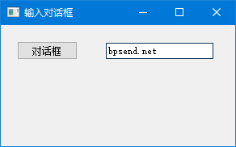
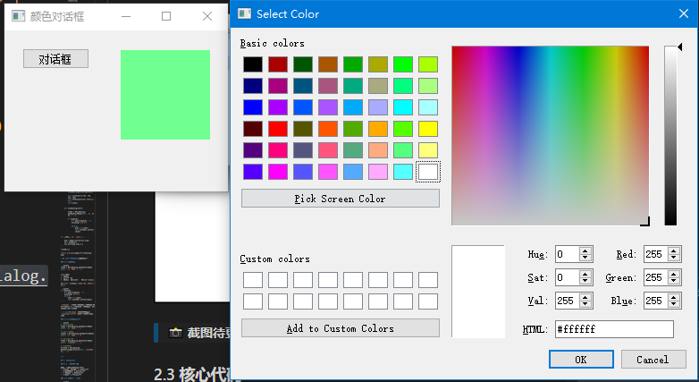
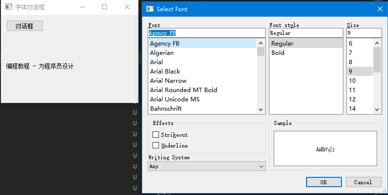
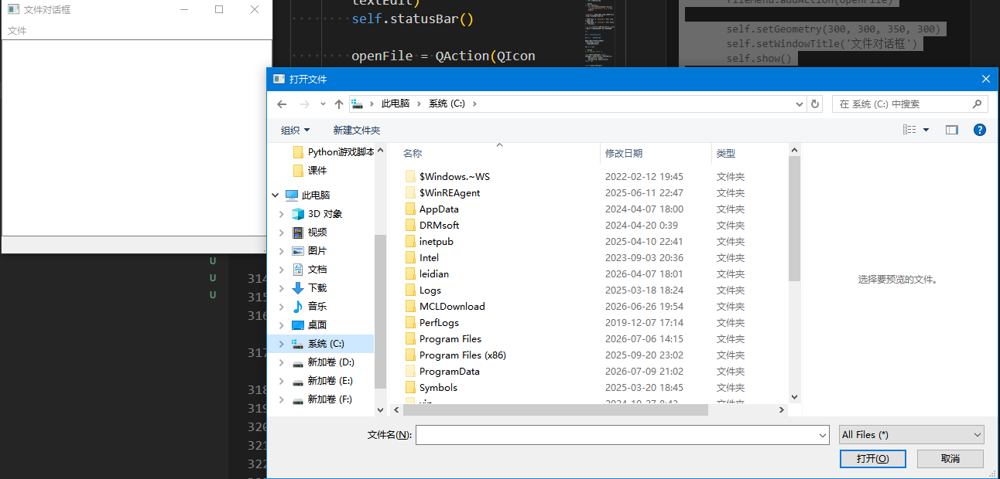

# 对话框

你有没有注意过，当你点击"打开文件"、"保存"、"退出"时，都会弹出一个小窗口让你操作？

这种小窗口就叫**对话框**。它的特点是：弹出来之后，你必须先处理它，才能回到主窗口。

PyQt5 内置了好几种常用对话框，我们一个一个来。

---

## 1. 输入对话框

### 1.1 什么时候用？

当你只需要用户输入**一行文字**时，比如：
- 输入用户名
- 输入搜索关键词
- 输入备注信息

不用自己写一整个窗口，一个对话框就搞定。

### 1.2 例子

```python
# -*- coding: utf-8 -*-

from PyQt5.QtWidgets import (QWidget, QPushButton, QLineEdit, 
    QInputDialog, QApplication)
import sys


class Example(QWidget):

    def __init__(self):
        super().__init__()

        self.initUI()


    def initUI(self):      

        self.btn = QPushButton('对话框', self)
        self.btn.move(20, 20)
        self.btn.clicked.connect(self.showDialog)

        self.le = QLineEdit(self)
        self.le.move(130, 22)

        self.setGeometry(300, 300, 290, 150)
        self.setWindowTitle('输入对话框')
        self.show()


    def showDialog(self):

        text, ok = QInputDialog.getText(self, '输入对话框', '输入你的名字:')

        if ok:
            self.le.setText(str(text))


if __name__ == '__main__':

    app = QApplication(sys.argv)
    ex = Example()
    sys.exit(app.exec_())
```

程序预览：




### 1.3 核心代码

```python
text, ok = QInputDialog.getText(self, '输入对话框', '输入你的名字:')
```

这行代码会弹出一个对话框，等用户输入后返回两个值：

| 返回值 | 类型 | 说明 |
|--------|------|------|
| `text` | 字符串 | 用户输入的内容 |
| `ok` | 布尔值 | 点了"确定"是 True，点了"取消"是 False |

```python
if ok:
    self.le.setText(str(text))
```

只有用户点了"确定"，才把输入的内容显示到输入框里。如果点了"取消"，就当什么都没发生。

> 💡 **小贴士**：`QInputDialog` 还有其他方法：
> - `getInt()` → 输入整数
> - `getDouble()` → 输入小数
> - `getItem()` → 从下拉列表选择

---

## 2. 颜色选择对话框

### 2.1 什么时候用？

需要用户选颜色时，比如：
- 设置文字颜色
- 设置背景颜色
- 绘图工具选色

### 2.2 例子

```python
# -*- coding: utf-8 -*-

from PyQt5.QtWidgets import (QWidget, QPushButton, QFrame, 
    QColorDialog, QApplication)
from PyQt5.QtGui import QColor
import sys


class Example(QWidget):

    def __init__(self):
        super().__init__()

        self.initUI()


    def initUI(self):      

        col = QColor(0, 0, 0)  # 初始颜色：黑色

        self.btn = QPushButton('对话框', self)
        self.btn.move(20, 20)

        self.btn.clicked.connect(self.showDialog)

        # 用来显示颜色的方块
        self.frm = QFrame(self)
        self.frm.setStyleSheet("QWidget { background-color: %s }" % col.name())
        self.frm.setGeometry(130, 22, 100, 100)

        self.setGeometry(300, 300, 250, 180)
        self.setWindowTitle('颜色对话框')
        self.show()


    def showDialog(self):

        col = QColorDialog.getColor()

        if col.isValid():
            self.frm.setStyleSheet("QWidget { background-color: %s }" % col.name())


if __name__ == '__main__':

    app = QApplication(sys.argv)
    ex = Example()
    sys.exit(app.exec_())
```

程序预览：




### 2.3 核心代码

```python
col = QColorDialog.getColor()
```

一行弹出颜色选择器。

```python
if col.isValid():
    self.frm.setStyleSheet("QWidget { background-color: %s }" % col.name())
```

`isValid()` 判断用户是选了颜色点"确定"，还是直接点了"取消"。

- 点了"确定" → `isValid()` 返回 True → 更新颜色
- 点了"取消" → `isValid()` 返回 False → 什么都不做

> 🎮 **动手试试**：点"对话框"按钮，选个颜色，看看左边的方块是不是变色了？

---

## 3. 字体选择对话框

### 3.1 什么时候用？

需要用户选字体时，比如：
- 文本编辑器选字体
- 设置界面字体大小

### 3.2 例子

```python
# -*- coding: utf-8 -*-

from PyQt5.QtWidgets import (QWidget, QVBoxLayout, QPushButton, 
    QSizePolicy, QLabel, QFontDialog, QApplication)
import sys


class Example(QWidget):

    def __init__(self):
        super().__init__()

        self.initUI()


    def initUI(self):      

        vbox = QVBoxLayout()

        btn = QPushButton('对话框', self)
        btn.setSizePolicy(QSizePolicy.Fixed, QSizePolicy.Fixed)

        vbox.addWidget(btn)
        btn.clicked.connect(self.showDialog)

        self.lbl = QLabel('编程教程 - 为程序员设计', self)
        vbox.addWidget(self.lbl)
        
        self.setLayout(vbox)          

        self.setGeometry(300, 300, 280, 180)
        self.setWindowTitle('字体对话框')
        self.show()


    def showDialog(self):

        font, ok = QFontDialog.getFont()

        if ok:
            self.lbl.setFont(font)


if __name__ == '__main__':

    app = QApplication(sys.argv)
    ex = Example()
    sys.exit(app.exec_())
```

程序预览：




### 3.3 核心代码

```python
font, ok = QFontDialog.getFont()
```

弹出字体选择对话框，返回选中的字体和是否确认。

```python
if ok:
    self.lbl.setFont(font)
```

用户点了"确定"，就把选中的字体设置到标签上。

---

## 4. 文件选择对话框

### 4.1 什么时候用？

这是**最常用**的对话框之一：
- 打开文件
- 保存文件
- 导入/导出

### 4.2 例子：打开文件

```python
# -*- coding: utf-8 -*-

from PyQt5.QtWidgets import (QMainWindow, QTextEdit, 
    QAction, QFileDialog, QApplication)
from PyQt5.QtGui import QIcon
import sys


class Example(QMainWindow):

    def __init__(self):
        super().__init__()

        self.initUI()


    def initUI(self):      

        self.textEdit = QTextEdit()
        self.setCentralWidget(self.textEdit)
        self.statusBar()

        openFile = QAction(QIcon('open.png'), '打开', self)
        openFile.setShortcut('Ctrl+O')
        openFile.setStatusTip('打开新文件')
        openFile.triggered.connect(self.showDialog)

        menubar = self.menuBar()
        fileMenu = menubar.addMenu('文件')
        fileMenu.addAction(openFile)

        self.setGeometry(300, 300, 350, 300)
        self.setWindowTitle('文件对话框')
        self.show()


    def showDialog(self):

        fname = QFileDialog.getOpenFileName(self, '打开文件', '.')

        if fname[0]:
            f = open(fname[0], 'r', encoding='utf-8')

            with f:
                data = f.read()
                self.textEdit.setText(data)


if __name__ == '__main__':

    app = QApplication(sys.argv)
    ex = Example()
    sys.exit(app.exec_())
```

程序预览：




### 4.3 核心代码

```python
fname = QFileDialog.getOpenFileName(self, '打开文件', '.')
```

三个参数：
1. 父窗口
2. 对话框标题
3. 默认打开的目录（`.` 表示当前目录）

返回值是一个元组：`(文件路径, 文件类型过滤器)`

```python
if fname[0]:
    f = open(fname[0], 'r', encoding='utf-8')
    with f:
        data = f.read()
        self.textEdit.setText(data)
```

`fname[0]` 是文件路径。如果用户点了"取消"，这个值是空字符串。所以先判断一下，有文件路径再读取。

> ⚠️ **注意**：打开文件时记得指定 `encoding='utf-8'`，否则中文可能会乱码。

### 4.4 其他文件对话框

```python
# 选择单个文件
fname = QFileDialog.getOpenFileName(self, '打开文件', '.')

# 选择多个文件
fnames = QFileDialog.getOpenFileNames(self, '打开文件', '.')

# 选择保存路径
fname = QFileDialog.getSaveFileName(self, '保存文件', '.')

# 选择文件夹
dirname = QFileDialog.getExistingDirectory(self, '选择文件夹', '.')
```

---

## 5. 消息对话框

### 5.1 什么时候用？

需要和用户确认或者提醒时：
- "确定要删除吗？" → 确认对话框
- "保存成功！" → 提示对话框
- "出错了！" → 错误对话框
- "注意！" → 警告对话框

### 5.2 例子：退出确认

```python
# -*- coding: utf-8 -*-

from PyQt5.QtWidgets import QApplication, QWidget, QMessageBox

class Example(QWidget):
    def __init__(self):
        super().__init__()
        self.initUI()
    
    def initUI(self):
        self.setWindowTitle('消息对话框示例')
        self.resize(300, 200)
        self.show()
    
    def closeEvent(self, event):
        """关闭窗口时触发"""
        reply = QMessageBox.question(self, '确认', 
            '确定要退出吗？', 
            QMessageBox.Yes | QMessageBox.No, 
            QMessageBox.No)

        if reply == QMessageBox.Yes:
            event.accept()  # 接受关闭，窗口关闭
        else:
            event.ignore()  # 忽略关闭，窗口不关闭


if __name__ == '__main__':
    app = QApplication([])
    ex = Example()
    app.exec_()
```

### 5.3 核心代码

```python
reply = QMessageBox.question(self, '确认', 
    '确定要退出吗？', 
    QMessageBox.Yes | QMessageBox.No, 
    QMessageBox.No)
```

五个参数：
1. 父窗口
2. 标题
3. 消息内容
4. 按钮组合（`Yes | No` 表示显示"是"和"否"两个按钮）
5. 默认焦点（`QMessageBox.No` 表示默认选中"否"）

```python
if reply == QMessageBox.Yes:
    event.accept()  # 接受关闭
else:
    event.ignore()  # 取消关闭
```

根据用户的选择来决定是关闭还是保留窗口。

### 5.4 其他消息类型

```python
# 提示信息（只有一个"确定"按钮）
QMessageBox.information(self, '提示', '保存成功！')

# 警告信息
QMessageBox.warning(self, '警告', '文件即将过期！')

# 错误信息
QMessageBox.critical(self, '错误', '文件读取失败！')

# 关于信息
QMessageBox.about(self, '关于', '这是一个示例程序')
```

| 类型 | 图标 | 用途 |
|------|------|------|
| `information` | ℹ️ | 一般提示 |
| `warning` | ⚠️ | 警告 |
| `critical` | ❌ | 错误 |
| `question` | ❓ | 确认 |
| `about` | ℹ️ | 关于信息 |

---

## 6. 对话框速查表

| 对话框类 | 什么时候用 | 核心方法 |
|---------|-----------|---------|
| `QInputDialog` | 输入一行文字/数字 | `getText()`, `getInt()` |
| `QColorDialog` | 选颜色 | `getColor()` |
| `QFontDialog` | 选字体 | `getFont()` |
| `QFileDialog` | 选文件/文件夹 | `getOpenFileName()`, `getSaveFileName()` |
| `QMessageBox` | 提示/确认/警告 | `question()`, `information()`, `warning()` |

---

## 7. 实战：组合使用

实际项目中，这些对话框经常组合使用。比如一个文本编辑器：

```python
# 打开文件
fname = QFileDialog.getOpenFileName(self, '打开文件', '.')
if fname[0]:
    with open(fname[0], 'r', encoding='utf-8') as f:
        text = f.read()
        self.textEdit.setText(text)

# 保存前确认
if self.isModified():
    reply = QMessageBox.question(self, '确认', '文件已修改，是否保存？')
    if reply == QMessageBox.Yes:
        QFileDialog.getSaveFileName(self, '保存文件', '.')
    
# 操作成功提示
QMessageBox.information(self, '提示', '保存成功！')
```

> 🎮 **动手试试**：把本章的代码都跑一遍，感受一下各种对话框的用法。

---

掌握对话框的使用后，我们就可以与用户进行各种交互了。下一章介绍 PyQt5 中最常用的控件。