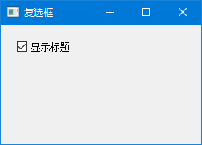
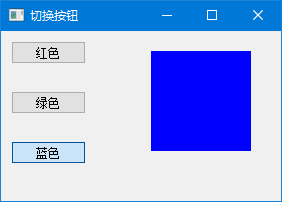
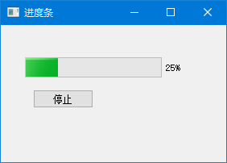
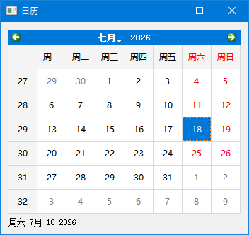
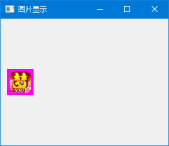
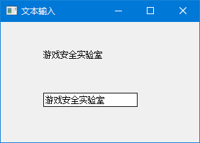
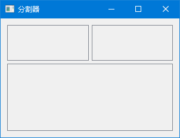
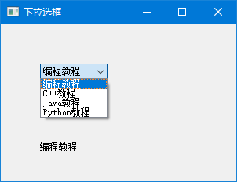

# 控件大全

控件就是界面上的各种"零件"：按钮、输入框、下拉菜单、进度条……

PyQt5 提供了很多控件，但不用一次全记住。本章只介绍**最常用**的 8 种，其他的用到的时候再查文档就行。

---

## 1. 复选框 QCheckBox

### 1.1 什么时候用？

需要用户在"开"和"关"之间切换时，比如：
- ☑ 记住密码
- ☑ 自动登录
- ☑ 显示标题

### 1.2 例子

```python
# -*- coding: utf-8 -*-

from PyQt5.QtWidgets import QWidget, QCheckBox, QApplication
from PyQt5.QtCore import Qt
import sys


class Example(QWidget):

    def __init__(self):
        super().__init__()

        self.initUI()


    def initUI(self):      

        cb = QCheckBox('显示标题', self)
        cb.move(20, 20)
        cb.toggle()  # 默认选中
        cb.stateChanged.connect(self.changeTitle)

        self.setGeometry(300, 300, 250, 150)
        self.setWindowTitle('复选框')
        self.show()


    def changeTitle(self, state):

        if state == Qt.Checked:
            self.setWindowTitle('复选框')
        else:
            self.setWindowTitle('')


if __name__ == '__main__':

    app = QApplication(sys.argv)
    ex = Example()
    sys.exit(app.exec_())
```

程序预览：




### 1.3 核心代码

```python
cb.stateChanged.connect(self.changeTitle)
```

复选框状态改变时触发信号。

```python
def changeTitle(self, state):
    if state == Qt.Checked:
        self.setWindowTitle('复选框')
    else:
        self.setWindowTitle('')
```

`state` 有三种可能：
- `Qt.Checked`（2）→ 选中
- `Qt.Unchecked`（0）→ 未选中
- `Qt.PartiallyChecked`（1）→ 部分选中（三态复选框用）

> 💡 **小贴士**：`cb.toggle()` 让复选框默认选中。也可以用 `cb.setChecked(True)`。

---

## 2. 切换按钮 QToggleButton

### 2.1 什么是切换按钮？

切换按钮就是"按一下开，再按一下关"的按钮。比如电灯开关。

### 2.2 例子：RGB 混色器

三个按钮分别控制红、绿、蓝，组合出不同颜色。

```python
# -*- coding: utf-8 -*-

from PyQt5.QtWidgets import (QWidget, QPushButton, 
    QFrame, QApplication)
from PyQt5.QtGui import QColor
import sys


class Example(QWidget):

    def __init__(self):
        super().__init__()

        self.initUI()


    def initUI(self):      

        self.col = QColor(0, 0, 0)  # 初始颜色：黑色（全关）

        # 红色按钮
        redb = QPushButton('红色', self)
        redb.setCheckable(True)  # 变成切换按钮
        redb.move(10, 10)
        redb.clicked[bool].connect(self.setColor)

        # 绿色按钮
        greenb = QPushButton('绿色', self)
        greenb.setCheckable(True)
        greenb.move(10, 60)
        greenb.clicked[bool].connect(self.setColor)

        # 蓝色按钮
        blueb = QPushButton('蓝色', self)
        blueb.setCheckable(True)
        blueb.move(10, 110)
        blueb.clicked[bool].connect(self.setColor)

        # 颜色显示方块
        self.square = QFrame(self)
        self.square.setGeometry(150, 20, 100, 100)
        self.square.setStyleSheet("QWidget { background-color: %s }" %  
            self.col.name())

        self.setGeometry(300, 300, 280, 170)
        self.setWindowTitle('切换按钮')
        self.show()


    def setColor(self, pressed):

        source = self.sender()  # 获取是哪个按钮触发的

        if pressed:
            val = 255
        else:
            val = 0

        if source.text() == "红色":
            self.col.setRed(val)                
        elif source.text() == "绿色":
            self.col.setGreen(val)             
        else:
            self.col.setBlue(val) 

        self.square.setStyleSheet("QFrame { background-color: %s }" %
            self.col.name())


if __name__ == '__main__':

    app = QApplication(sys.argv)
    ex = Example()
    sys.exit(app.exec_())
```

程序预览：




### 2.3 核心代码

```python
redb.setCheckable(True)
```

普通按钮默认是"按一下弹起来"，设置 `setCheckable(True)` 后就变成"按一下保持按下"。

```python
redb.clicked[bool].connect(self.setColor)
```

`[bool]` 表示我们接收带布尔参数的 `clicked` 信号，`True` 表示按下，`False` 表示弹起。

```python
source = self.sender()
```

`self.sender()` 返回触发信号的控件。这样三个按钮可以共用一个槽函数。

> 🎮 **动手试试**：同时按下红、绿、蓝三个按钮，看看颜色是不是变成白色了？

---

## 3. 滑块 QSlider

### 3.1 什么时候用？

需要在一个范围内选值时，比如：
- 音量调节
- 亮度调节
- 缩放比例

### 3.2 例子

```python
# -*- coding: utf-8 -*-

from PyQt5.QtWidgets import (QWidget, QSlider, 
    QLabel, QApplication)
from PyQt5.QtCore import Qt
from PyQt5.QtGui import QPixmap
import sys


class Example(QWidget):

    def __init__(self):
        super().__init__()

        self.initUI()


    def initUI(self):      

        sld = QSlider(Qt.Horizontal, self)
        sld.setFocusPolicy(Qt.NoFocus)
        sld.setGeometry(30, 40, 200, 30)
        sld.valueChanged[int].connect(self.changeValue)

        self.label = QLabel(self)
        self.label.setAlignment(Qt.AlignCenter)
        self.label.setGeometry(160, 40, 80, 30)

        self.setGeometry(300, 300, 280, 170)
        self.setWindowTitle('滑块')
        self.show()


    def changeValue(self, value):

        if value == 0:
            self.label.setText('🔇 静音')
        elif value <= 30:
            self.label.setText('🔈 小声')
        elif value < 80:
            self.label.setText('🔊 中等')
        else:
            self.label.setText('🔊 大声')


if __name__ == '__main__':

    app = QApplication(sys.argv)
    ex = Example()
    sys.exit(app.exec_())
```

### 3.3 核心代码

```python
sld = QSlider(Qt.Horizontal, self)
```

`Qt.Horizontal` 是水平滑块，`Qt.Vertical` 是垂直滑块。

```python
sld.valueChanged[int].connect(self.changeValue)
```

滑块值改变时触发信号，`[int]` 表示接收整数参数。

```python
def changeValue(self, value):
    # value 范围默认是 0 ~ 99
```

滑块默认范围是 0~99。可以用 `sld.setRange(0, 100)` 自定义范围。

> 💡 **小贴士**：滑块常用方法：
> - `setRange(min, max)` → 设置范围
> - `setValue(n)` → 设置当前值
> - `setSingleStep(n)` → 设置步长

---

## 4. 进度条 QProgressBar

### 4.1 什么时候用？

显示任务进度时，比如：
- 文件下载进度
- 安装进度
- 处理进度

### 4.2 例子

```python
# -*- coding: utf-8 -*-

from PyQt5.QtWidgets import (QWidget, QProgressBar, 
    QPushButton, QApplication)
from PyQt5.QtCore import QBasicTimer
import sys


class Example(QWidget):

    def __init__(self):
        super().__init__()

        self.initUI()


    def initUI(self):      

        self.pbar = QProgressBar(self)
        self.pbar.setGeometry(30, 40, 200, 25)

        self.btn = QPushButton('开始', self)
        self.btn.move(40, 80)
        self.btn.clicked.connect(self.doAction)

        self.timer = QBasicTimer()
        self.step = 0

        self.setGeometry(300, 300, 280, 170)
        self.setWindowTitle('进度条')
        self.show()


    def timerEvent(self, e):

        if self.step >= 100:
            self.timer.stop()
            self.btn.setText('完成')
            return

        self.step = self.step + 1
        self.pbar.setValue(self.step)


    def doAction(self):

        if self.timer.isActive():
            self.timer.stop()
            self.btn.setText('开始')
        else:
            self.timer.start(100, self)
            self.btn.setText('停止')


if __name__ == '__main__':

    app = QApplication(sys.argv)
    ex = Example()
    sys.exit(app.exec_())
```

程序预览：




### 4.3 核心代码

```python
self.timer = QBasicTimer()
```

`QBasicTimer` 是一个简单的定时器，每隔一段时间触发一次 `timerEvent`。

```python
def timerEvent(self, e):
    if self.step >= 100:
        self.timer.stop()
        self.btn.setText('完成')
        return

    self.step = self.step + 1
    self.pbar.setValue(self.step)
```

每次定时器触发，进度 +1，更新进度条。到 100 就停止。

```python
def doAction(self):
    if self.timer.isActive():
        self.timer.stop()
        self.btn.setText('开始')
    else:
        self.timer.start(100, self)
        self.btn.setText('停止')
```

按钮是"开始/停止"切换：
- 定时器在跑 → 点一下停止
- 定时器停了 → 点一下开始（100 毫秒触发一次）

> 💡 **小贴士**：`QBasicTimer` 的 `start(100, self)` 中，100 是毫秒，`self` 是接收 `timerEvent` 的对象。

---

## 5. 日历 QCalendarWidget

### 5.1 什么时候用？

需要用户选日期时，比如：
- 选择生日
- 选择预约时间
- 选择起止日期

### 5.2 例子

```python
# -*- coding: utf-8 -*-

from PyQt5.QtWidgets import (QWidget, QCalendarWidget, 
    QLabel, QApplication, QVBoxLayout)
from PyQt5.QtCore import QDate
import sys


class Example(QWidget):

    def __init__(self):
        super().__init__()

        self.initUI()


    def initUI(self):      

        vbox = QVBoxLayout(self)

        cal = QCalendarWidget(self)
        cal.setGridVisible(True)
        cal.clicked[QDate].connect(self.showDate)

        vbox.addWidget(cal)

        self.lbl = QLabel(self)
        date = cal.selectedDate()
        self.lbl.setText(date.toString())
        vbox.addWidget(self.lbl)

        self.setLayout(vbox)

        self.setGeometry(300, 300, 350, 300)
        self.setWindowTitle('日历')
        self.show()


    def showDate(self, date):     

        self.lbl.setText(date.toString())


if __name__ == '__main__':

    app = QApplication(sys.argv)
    ex = Example()
    sys.exit(app.exec_())
```

程序预览：




### 5.3 核心代码

```python
cal.clicked[QDate].connect(self.showDate)
```

点击日历上的日期时触发信号，返回一个 `QDate` 对象。

```python
def showDate(self, date):
    self.lbl.setText(date.toString())
```

`date.toString()` 把日期转成字符串显示。

> 💡 **小贴士**：`QDate` 常用方法：
> - `year()` → 获取年份
> - `month()` → 获取月份
> - `day()` → 获取日期
> - `toString("yyyy-MM-dd")` → 自定义格式

---

## 6. 图片显示 QLabel

### 6.1 什么时候用？

显示图片时，比如：
- 用户头像
- 产品图片
- Logo

### 6.2 例子

```python
# -*- coding: utf-8 -*-

from PyQt5.QtWidgets import (QWidget, QHBoxLayout, 
    QLabel, QApplication)
from PyQt5.QtGui import QPixmap
import sys


class Example(QWidget):

    def __init__(self):
        super().__init__()

        self.initUI()


    def initUI(self):      

        hbox = QHBoxLayout(self)
        pixmap = QPixmap("redrock.png")

        lbl = QLabel(self)
        lbl.setPixmap(pixmap)

        hbox.addWidget(lbl)
        self.setLayout(hbox)

        self.move(300, 200)
        self.setWindowTitle('图片显示')
        self.show()      


if __name__ == '__main__':

    app = QApplication(sys.argv)
    ex = Example()
    sys.exit(app.exec_())
```

程序预览：




### 6.3 核心代码

```python
pixmap = QPixmap("redrock.png")
lbl.setPixmap(pixmap)
```

`QPixmap` 加载图片，`setPixmap()` 设置到标签上。

> ⚠️ **注意**：如果图片路径不对，图片会显示不出来，但不会报错。检查路径是否正确。

---

## 7. 文本输入 QLineEdit

### 7.1 什么时候用？

需要用户输入**单行文字**时，比如：
- 用户名
- 密码
- 搜索框

### 7.2 例子

```python
# -*- coding: utf-8 -*-

from PyQt5.QtWidgets import (QWidget, QLabel, 
    QLineEdit, QApplication)
import sys


class Example(QWidget):

    def __init__(self):
        super().__init__()

        self.initUI()


    def initUI(self):      

        self.lbl = QLabel(self)
        qle = QLineEdit(self)

        qle.move(60, 100)
        self.lbl.move(60, 40)

        qle.textChanged[str].connect(self.onChanged)

        self.setGeometry(300, 300, 280, 170)
        self.setWindowTitle('文本输入')
        self.show()


    def onChanged(self, text):

        self.lbl.setText(text)
        self.lbl.adjustSize()


if __name__ == '__main__':

    app = QApplication(sys.argv)
    ex = Example()
    sys.exit(app.exec_())
```

程序预览：




### 7.3 核心代码

```python
qle.textChanged[str].connect(self.onChanged)
```

文本改变时触发信号，返回当前输入的文本。

```python
def onChanged(self, text):
    self.lbl.setText(text)
    self.lbl.adjustSize()
```

`adjustSize()` 让标签自动调整大小以适应文本。

> 💡 **小贴士**：`QLineEdit` 常用方法：
> - `setPlaceholderText("提示文字")` → 设置占位提示
> - `setEchoMode(QLineEdit.Password)` → 密码模式
> - `setReadOnly(True)` → 只读
> - `clear()` → 清空内容

---

## 8. 分割器 QSplitter

### 8.1 什么时候用？

需要用户自己拖拽调整控件大小时，比如：
- 文件管理器（左边目录树，右边文件列表）
- 代码编辑器（左边代码，右边预览）

### 8.2 例子

```python
# -*- coding: utf-8 -*-

from PyQt5.QtWidgets import (QWidget, QHBoxLayout, QFrame, 
    QSplitter, QApplication)
from PyQt5.QtCore import Qt
import sys


class Example(QWidget):

    def __init__(self):
        super().__init__()

        self.initUI()


    def initUI(self):      

        hbox = QHBoxLayout(self)

        # 三个面板
        topleft = QFrame(self)
        topleft.setFrameShape(QFrame.StyledPanel)
 
        topright = QFrame(self)
        topright.setFrameShape(QFrame.StyledPanel)

        bottom = QFrame(self)
        bottom.setFrameShape(QFrame.StyledPanel)

        # 水平分割器：放左上和右上
        splitter1 = QSplitter(Qt.Horizontal)
        splitter1.addWidget(topleft)
        splitter1.addWidget(topright)

        # 垂直分割器：放水平分割器和底部
        splitter2 = QSplitter(Qt.Vertical)
        splitter2.addWidget(splitter1)
        splitter2.addWidget(bottom)

        hbox.addWidget(splitter2)
        self.setLayout(hbox)

        self.setGeometry(300, 300, 300, 200)
        self.setWindowTitle('分割器')
        self.show()


if __name__ == '__main__':

    app = QApplication(sys.argv)
    ex = Example()
    sys.exit(app.exec_())
```

程序预览：




### 8.3 核心代码

```python
splitter1 = QSplitter(Qt.Horizontal)
splitter1.addWidget(topleft)
splitter1.addWidget(topright)
```

水平分割器，里面的控件可以左右拖拽调整大小。

```python
splitter2 = QSplitter(Qt.Vertical)
splitter2.addWidget(splitter1)
splitter2.addWidget(bottom)
```

垂直分割器，把水平分割器也放进去，实现嵌套布局。

> 🎮 **动手试试**：运行程序，拖拽分割线，看看面板是不是能自由调整大小了？

---

## 9. 下拉选框 QComboBox

### 9.1 什么时候用？

需要从列表中**选一个**时，比如：
- 选择城市
- 选择语言
- 选择分类

### 9.2 例子

```python
# -*- coding: utf-8 -*-

from PyQt5.QtWidgets import (QWidget, QLabel, 
    QComboBox, QApplication)
import sys


class Example(QWidget):

    def __init__(self):
        super().__init__()

        self.initUI()


    def initUI(self):      

        self.lbl = QLabel("编程教程", self)

        combo = QComboBox(self)
        combo.addItem("编程教程")
        combo.addItem("C++教程")
        combo.addItem("Java教程")
        combo.addItem("Python教程")

        combo.move(50, 50)
        self.lbl.move(50, 150)

        combo.activated[str].connect(self.onActivated)        

        self.setGeometry(300, 300, 300, 200)
        self.setWindowTitle('下拉选框')
        self.show()


    def onActivated(self, text):

        self.lbl.setText(text)
        self.lbl.adjustSize()


if __name__ == '__main__':

    app = QApplication(sys.argv)
    ex = Example()
    sys.exit(app.exec_())
```

程序预览：




### 9.3 核心代码

```python
combo.addItem("编程教程")
```

添加一个选项。也可以批量添加：

```python
combo.addItems(["编程教程", "C++教程", "Java教程"])
```

```python
combo.activated[str].connect(self.onActivated)
```

选中某个选项时触发信号，返回选中的文本。

> 💡 **小贴士**：`QComboBox` 常用方法：
> - `currentIndex()` → 获取当前索引（从0开始）
> - `currentText()` → 获取当前文本
> - `count()` → 获取选项数量
> - `clear()` → 清空所有选项

---

## 10. 控件速查表

| 控件 | 什么时候用 | 核心信号 |
|------|-----------|---------|
| `QCheckBox` | 开关/勾选 | `stateChanged` |
| `QPushButton`（可切换） | 按一下开/关 | `clicked[bool]` |
| `QSlider` | 范围内选值 | `valueChanged` |
| `QProgressBar` | 显示进度 | 无（用 `setValue()` 更新） |
| `QCalendarWidget` | 选日期 | `clicked[QDate]` |
| `QLineEdit` | 单行输入 | `textChanged` |
| `QComboBox` | 下拉选择 | `activated` |
| `QSplitter` | 可拖拽调整大小 | `splitterMoved` |

> 🎮 **动手试试**：把本章的代码都跑一遍，感受一下每个控件的用法。实际项目中，这些控件经常组合使用。

---

掌握这些常用控件后，我们就可以构建出功能丰富的界面了。下一章学习拖拽和绘图。