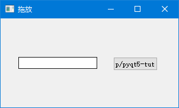
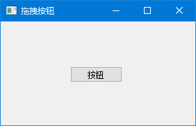
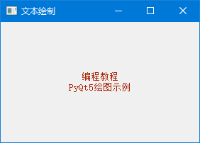
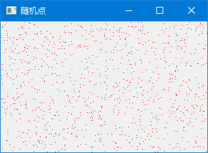
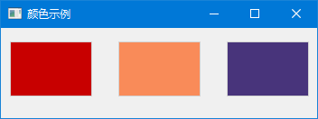
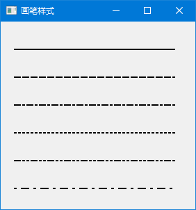
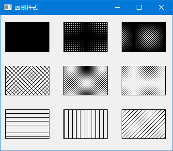
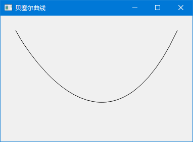

# 拖放与绘图

想让应用更生动？拖放和绘图能帮你实现。

- **拖放**：用户可以直接把文字拖到按钮上，或者拖动控件改变位置
- **绘图**：自己画图形、文字、曲线，做出炫酷的界面

---

## 1. 拖放操作

### 1.1 什么是拖放？

拖放就是：**按住 → 拖动 → 松开**。

比如：
- 把文件拖到窗口里打开
- 把文字拖到输入框里粘贴
- 拖动按钮改变位置

### 1.2 简单拖放：文字拖到按钮上

把输入框里的文字拖到按钮上，按钮文字就会改变。

```python
# -*- coding: utf-8 -*-

from PyQt5.QtWidgets import (QPushButton, QWidget, 
    QLineEdit, QApplication)
import sys


class Button(QPushButton):

    def __init__(self, title, parent):
        super().__init__(title, parent)
        # 告诉按钮：我接受拖放！
        self.setAcceptDrops(True)


    def dragEnterEvent(self, e):
        """有东西拖进来了，判断要不要接受"""
        if e.mimeData().hasText():
            e.accept()  # 接受
        else:
            e.ignore()  # 拒绝


    def dropEvent(self, e):
        """用户松开了，处理拖过来的数据"""
        self.setText(e.mimeData().text())


class Example(QWidget):

    def __init__(self):
        super().__init__()
        self.initUI()


    def initUI(self):

        # 输入框：允许拖出去
        edit = QLineEdit('', self)
        edit.setDragEnabled(True)
        edit.move(30, 65)

        # 按钮：接受拖放
        button = Button("按钮", self)
        button.move(190, 65)

        self.setWindowTitle('拖放')
        self.setGeometry(300, 300, 300, 150)
        self.show()


if __name__ == '__main__':

    app = QApplication(sys.argv)
    ex = Example()
    sys.exit(app.exec_())
```

程序预览：




### 1.3 核心概念

拖放涉及三个角色：

| 角色 | 说明 | 本例中 |
|------|------|--------|
| 拖放源 | 数据从哪里来 | 输入框（`setDragEnabled(True)`） |
| 拖放目标 | 数据到哪里去 | 按钮（`setAcceptDrops(True)`） |
| 数据 | 拖的是什么 | 文字（`mimeData().hasText()`） |

```python
edit.setDragEnabled(True)
```

这行让输入框支持拖放。用户选中文字后，就可以拖出去了。

```python
def dragEnterEvent(self, e):
    if e.mimeData().hasText():
        e.accept()
    else:
        e.ignore()
```

这是**门卫**：有文字拖过来就放行，其他数据就拒绝。

```python
def dropEvent(self, e):
    self.setText(e.mimeData().text())
```

这是**接收员**：用户松开鼠标后，把拖过来的文字设置成按钮文字。

> 🎮 **动手试试**：运行程序，在输入框里打字，然后选中文字拖到按钮上，看看按钮文字是不是变了？

---

### 1.4 拖动按钮

这次我们让按钮本身可以被拖动。

```python
# -*- coding: utf-8 -*-

from PyQt5.QtWidgets import QPushButton, QWidget, QApplication
from PyQt5.QtCore import Qt, QMimeData
from PyQt5.QtGui import QDrag
import sys


class Button(QPushButton):

    def __init__(self, title, parent):
        super().__init__(title, parent)


    def mouseMoveEvent(self, e):
        """鼠标移动时触发"""
        # 只有右键才触发拖放
        if e.buttons() != Qt.RightButton:
            return

        mimeData = QMimeData()

        drag = QDrag(self)
        drag.setMimeData(mimeData)
        drag.setHotSpot(e.pos() - self.rect().topLeft())

        drag.exec_(Qt.MoveAction)


    def mousePressEvent(self, e):
        """鼠标按下时触发"""
        super().mousePressEvent(e)
        if e.button() == Qt.LeftButton:
            print('左键按下')


class Example(QWidget):

    def __init__(self):
        super().__init__()
        self.initUI()


    def initUI(self):

        self.setAcceptDrops(True)  # 窗口接受拖放

        self.button = Button('按钮', self)
        self.button.move(100, 65)

        self.setWindowTitle('拖拽按钮')
        self.setGeometry(300, 300, 280, 150)
        self.show()


    def dragEnterEvent(self, e):
        e.accept()


    def dropEvent(self, e):
        position = e.pos()
        self.button.move(position)

        e.setDropAction(Qt.MoveAction)
        e.accept()


if __name__ == '__main__':

    app = QApplication(sys.argv)
    ex = Example()
    sys.exit(app.exec_())
```

程序预览：




### 1.4 核心代码

```python
def mouseMoveEvent(self, e):
    if e.buttons() != Qt.RightButton:
        return
```

只有按住**右键**拖动时才触发。左键留给普通点击。

```python
drag = QDrag(self)
drag.setMimeData(mimeData)
drag.exec_(Qt.MoveAction)
```

创建拖放对象，设置数据，开始拖放。

```python
def dropEvent(self, e):
    position = e.pos()
    self.button.move(position)
```

窗口接收到拖放位置，把按钮移过去。

> 🎮 **动手试试**：按住右键拖动按钮，松开后按钮是不是跑到新位置了？

---

## 2. 绘图基础

### 2.1 什么时候需要自己绘图？

内置控件搞不定时，就得自己画：
- 画一个仪表盘
- 画一个波形图
- 画一个自定义进度条
- 画游戏画面

### 2.2 核心概念：paintEvent

```python
def paintEvent(self, event):
    qp = QPainter()
    qp.begin(self)
    # 在这里画东西
    qp.end()
```

**paintEvent** 是窗口的"画图时间"。以下情况会自动触发：
- 窗口第一次显示
- 窗口被遮挡后重新显示
- 窗口大小改变
- 手动调用 `self.update()`

> 💡 **重要**：不要在 `paintEvent` 里做耗时操作，它会阻塞界面刷新。

### 2.3 画文字

```python
# -*- coding: utf-8 -*-

import sys
from PyQt5.QtWidgets import QWidget, QApplication
from PyQt5.QtGui import QPainter, QColor, QFont
from PyQt5.QtCore import Qt

class Example(QWidget):

    def __init__(self):
        super().__init__()
        self.initUI()


    def initUI(self):      

        self.text = "编程教程\nPyQt5绘图示例"

        self.setGeometry(300, 300, 280, 170)
        self.setWindowTitle('文本绘制')
        self.show()


    def paintEvent(self, event):

        qp = QPainter()
        qp.begin(self)
        self.drawText(event, qp)
        qp.end()


    def drawText(self, event, qp):

        qp.setPen(QColor(168, 34, 3))  # 设置文字颜色
        qp.setFont(QFont('Decorative', 10))  # 设置字体
        qp.drawText(event.rect(), Qt.AlignCenter, self.text)  # 居中绘制


if __name__ == '__main__':

    app = QApplication(sys.argv)
    ex = Example()
    sys.exit(app.exec_())
```

程序预览：




### 2.4 画随机点

```python
# -*- coding: utf-8 -*-

from PyQt5.QtWidgets import QWidget, QApplication
from PyQt5.QtGui import QPainter
from PyQt5.QtCore import Qt
import sys, random

class Example(QWidget):

    def __init__(self):
        super().__init__()
        self.initUI()


    def initUI(self):      

        self.setGeometry(300, 300, 300, 190)
        self.setWindowTitle('随机点')
        self.show()


    def paintEvent(self, e):

        qp = QPainter()
        qp.begin(self)
        self.drawPoints(qp)
        qp.end()


    def drawPoints(self, qp):

        qp.setPen(Qt.red)  # 红色画笔
        size = self.size()

        for i in range(1000):
            x = random.randint(1, size.width()-1)
            y = random.randint(1, size.height()-1)
            qp.drawPoint(x, y)     


if __name__ == '__main__':

    app = QApplication(sys.argv)
    ex = Example()
    sys.exit(app.exec_())
```

程序预览：




### 2.5 画矩形（颜色）

```python
# -*- coding: utf-8 -*-

from PyQt5.QtWidgets import QWidget, QApplication
from PyQt5.QtGui import QPainter, QColor, QBrush
import sys

class Example(QWidget):

    def __init__(self):
        super().__init__()
        self.initUI()


    def initUI(self):      

        self.setGeometry(300, 300, 350, 100)
        self.setWindowTitle('颜色示例')
        self.show()


    def paintEvent(self, e):

        qp = QPainter()
        qp.begin(self)
        self.drawRectangles(qp)
        qp.end()


    def drawRectangles(self, qp):

        col = QColor(0, 0, 0)
        col.setNamedColor('#d4d4d4')
        qp.setPen(col)

        qp.setBrush(QColor(200, 0, 0))  # 红色填充
        qp.drawRect(10, 15, 90, 60)

        qp.setBrush(QColor(255, 80, 0, 160))  # 橙色半透明
        qp.drawRect(130, 15, 90, 60)

        qp.setBrush(QColor(25, 0, 90, 200))  # 深蓝色半透明
        qp.drawRect(250, 15, 90, 60)


if __name__ == '__main__':

    app = QApplication(sys.argv)
    ex = Example()
    sys.exit(app.exec_())
```

程序预览：




### 2.6 画笔样式

```python
# -*- coding: utf-8 -*-

from PyQt5.QtWidgets import QWidget, QApplication
from PyQt5.QtGui import QPainter, QPen
from PyQt5.QtCore import Qt
import sys

class Example(QWidget):

    def __init__(self):
        super().__init__()
        self.initUI()


    def initUI(self):      

        self.setGeometry(300, 300, 280, 270)
        self.setWindowTitle('画笔样式')
        self.show()


    def paintEvent(self, e):

        qp = QPainter()
        qp.begin(self)
        self.drawLines(qp)
        qp.end()


    def drawLines(self, qp):

        pen = QPen(Qt.black, 2, Qt.SolidLine)

        qp.setPen(pen)
        qp.drawLine(20, 40, 250, 40)

        pen.setStyle(Qt.DashLine)
        qp.setPen(pen)
        qp.drawLine(20, 80, 250, 80)

        pen.setStyle(Qt.DashDotLine)
        qp.setPen(pen)
        qp.drawLine(20, 120, 250, 120)

        pen.setStyle(Qt.DotLine)
        qp.setPen(pen)
        qp.drawLine(20, 160, 250, 160)

        pen.setStyle(Qt.DashDotDotLine)
        qp.setPen(pen)
        qp.drawLine(20, 200, 250, 200)

        pen.setStyle(Qt.CustomDashLine)
        pen.setDashPattern([1, 4, 5, 4])
        qp.setPen(pen)
        qp.drawLine(20, 240, 250, 240)


if __name__ == '__main__':

    app = QApplication(sys.argv)
    ex = Example()
    sys.exit(app.exec_())
```

程序预览：




### 2.7 画刷样式

```python
# -*- coding: utf-8 -*-

from PyQt5.QtWidgets import QWidget, QApplication
from PyQt5.QtGui import QPainter, QBrush
from PyQt5.QtCore import Qt
import sys

class Example(QWidget):

    def __init__(self):
        super().__init__()
        self.initUI()


    def initUI(self):      

        self.setGeometry(300, 300, 355, 280)
        self.setWindowTitle('画刷样式')
        self.show()


    def paintEvent(self, e):

        qp = QPainter()
        qp.begin(self)
        self.drawBrushes(qp)
        qp.end()


    def drawBrushes(self, qp):

        brush = QBrush(Qt.SolidPattern)
        qp.setBrush(brush)
        qp.drawRect(10, 15, 90, 60)

        brush.setStyle(Qt.Dense1Pattern)
        qp.setBrush(brush)
        qp.drawRect(130, 15, 90, 60)

        brush.setStyle(Qt.Dense2Pattern)
        qp.setBrush(brush)
        qp.drawRect(250, 15, 90, 60)

        brush.setStyle(Qt.DiagCrossPattern)
        qp.setBrush(brush)
        qp.drawRect(10, 105, 90, 60)

        brush.setStyle(Qt.Dense5Pattern)
        qp.setBrush(brush)
        qp.drawRect(130, 105, 90, 60)

        brush.setStyle(Qt.Dense6Pattern)
        qp.setBrush(brush)
        qp.drawRect(250, 105, 90, 60)

        brush.setStyle(Qt.HorPattern)
        qp.setBrush(brush)
        qp.drawRect(10, 195, 90, 60)

        brush.setStyle(Qt.VerPattern)
        qp.setBrush(brush)
        qp.drawRect(130, 195, 90, 60)

        brush.setStyle(Qt.BDiagPattern)
        qp.setBrush(brush)
        qp.drawRect(250, 195, 90, 60)


if __name__ == '__main__':

    app = QApplication(sys.argv)
    ex = Example()
    sys.exit(app.exec_())
```

程序预览：




### 2.8 贝塞尔曲线

```python
# -*- coding: utf-8 -*-

from PyQt5.QtWidgets import QWidget, QApplication
from PyQt5.QtGui import QPainter, QPainterPath
from PyQt5.QtCore import Qt
import sys

class Example(QWidget):

    def __init__(self):
        super().__init__()
        self.initUI()


    def initUI(self):      

        self.setGeometry(300, 300, 380, 250)
        self.setWindowTitle('贝塞尔曲线')
        self.show()


    def paintEvent(self, e):

        qp = QPainter()
        qp.begin(self)
        qp.setRenderHint(QPainter.Antialiasing)  # 开启抗锯齿
        self.drawBezierCurve(qp)
        qp.end()


    def drawBezierCurve(self, qp):

        path = QPainterPath()
        path.moveTo(30, 30)
        path.cubicTo(30, 30, 200, 350, 350, 30)

        qp.drawPath(path)


if __name__ == '__main__':

    app = QApplication(sys.argv)
    ex = Example()
    sys.exit(app.exec_())
```

程序预览：




---

## 3. 拖拽与绘图实战 绘图核心概念

### 3.1 QPainter 三要素

画图就像画画，需要三样东西：

| 要素 | 类 | 作用 |
|------|-----|------|
| 画布 | `QPainter` | 在哪里画 |
| 画笔 | `QPen` | 画线条的颜色、粗细、样式 |
| 画刷 | `QBrush` | 填充的颜色、图案 |

```python
qp = QPainter()
qp.begin(self)

qp.setPen(QPen(Qt.black, 2, Qt.SolidLine))  # 黑色2像素实线
qp.setBrush(QBrush(Qt.red))  # 红色填充

qp.drawRect(10, 10, 50, 50)  # 画矩形

qp.end()
```

### 3.2 什么时候触发 paintEvent？

| 情况 | 说明 |
|------|------|
| 窗口第一次显示 | `show()` 后 |
| 窗口被遮挡后重新显示 | 其他窗口移开后 |
| 窗口大小改变 | 拉伸窗口时 |
| 手动调用 `update()` | 数据变了需要重绘 |

> ⚠️ **注意**：不要直接调用 `paintEvent()`，用 `self.update()` 代替。

### 3.3 抗锯齿

```python
qp.setRenderHint(QPainter.Antialiasing)
```

开启后，线条和曲线会更平滑。但会稍微降低性能。

---

## 4. 绘图 API 速查

### 4.1 常用绘图类

| 类名 | 用途 |
|------|------|
| `QPainter` | 绘图的主要类 |
| `QPen` | 画笔（线条样式） |
| `QBrush` | 画刷（填充样式） |
| `QColor` | 颜色 |
| `QFont` | 字体 |
| `QPixmap` | 图片 |
| `QPainterPath` | 复杂路径 |

### 4.2 常用绘图方法

| 方法 | 说明 |
|------|------|
| `drawPoint(x, y)` | 画点 |
| `drawLine(x1, y1, x2, y2)` | 画线 |
| `drawRect(x, y, w, h)` | 画矩形 |
| `drawEllipse(x, y, w, h)` | 画椭圆 |
| `drawText(rect, text)` | 画文本 |
| `drawPixmap(x, y, pixmap)` | 画图片 |
| `drawPath(path)` | 画路径 |

### 4.3 画笔样式

| 样式 | 效果 |
|------|------|
| `Qt.SolidLine` | 实线 |
| `Qt.DashLine` | 虚线 |
| `Qt.DotLine` | 点线 |
| `Qt.DashDotLine` | 点划线 |
| `Qt.DashDotDotLine` | 双点划线 |

---

掌握拖放和绘图功能后，我们就可以创建更加生动和交互的应用了。下一章学习如何创建自定义组件。