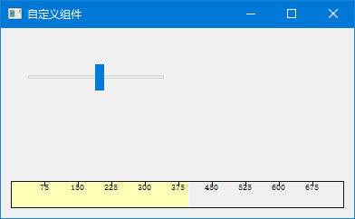

# 自定义组件

当内置控件无法满足需求时，我们可以自己"造轮子"。

---

## 1. 为什么要自定义组件？

PyQt5 内置了很多控件，但有时候你需要：
- 画一个**圆形进度条**（内置只有矩形进度条）
- 画一个**仪表盘**（没有现成的）
- 画一个**波形图**（需要自己绘制）
- 做一个**自定义开关按钮**（内置的太丑）

这时候就得自己画。

---

## 2. 自定义组件的步骤

### 2.1 四步走

```
1. 继承 QWidget → 2. 重写 paintEvent → 3. 添加接口方法 → 4. 使用自定义信号
```

### 2.2 最简单的例子：画一个红色方块

```python
# -*- coding: utf-8 -*-
import sys
from PyQt5.QtWidgets import QWidget, QApplication
from PyQt5.QtGui import QPainter, QBrush
from PyQt5.QtCore import Qt


class RedBox(QWidget):
    """自定义组件：红色方块"""
    
    def __init__(self):
        super().__init__()
        self.setMinimumSize(50, 50)  # 最小尺寸
    
    def paintEvent(self, event):
        """重写绘制方法"""
        painter = QPainter(self)
        painter.setBrush(QBrush(Qt.red))
        painter.drawRect(10, 10, 30, 30)


class Example(QWidget):
    def __init__(self):
        super().__init__()
        self.initUI()
    
    def initUI(self):
        self.setWindowTitle('自定义组件示例')
        self.setGeometry(300, 300, 200, 200)
        
        # 添加自定义组件
        self.red_box = RedBox()
        self.red_box.move(80, 80)
        self.red_box.setParent(self)
        
        self.show()


if __name__ == '__main__':
    app = QApplication(sys.argv)
    ex = Example()
    sys.exit(app.exec_())
```

> 💡 **核心**：继承 `QWidget`，重写 `paintEvent`，用 `QPainter` 画图。就这么简单。

---

## 3. 进阶示例：圆形进度条

### 3.1 效果

一个圆形的进度条，中间显示百分比。

### 3.2 代码

```python
# -*- coding: utf-8 -*-
import sys
from PyQt5.QtWidgets import (QWidget, QApplication, QVBoxLayout, 
                             QSlider, QLabel)
from PyQt5.QtGui import QPainter, QPen, QColor
from PyQt5.QtCore import Qt, pyqtSignal


class CircleProgress(QWidget):
    """圆形进度条"""
    valueChanged = pyqtSignal(int)  # 自定义信号
    
    def __init__(self):
        super().__init__()
        self.value = 0
        self.max_value = 100
        self.setMinimumSize(100, 100)
    
    def setValue(self, value):
        """设置进度值"""
        self.value = max(0, min(value, self.max_value))
        self.update()  # 触发重绘
        self.valueChanged.emit(self.value)
    
    def paintEvent(self, event):
        painter = QPainter(self)
        painter.setRenderHint(QPainter.Antialiasing)  # 抗锯齿
        
        # 绘制背景圆
        painter.setPen(QPen(QColor(200, 200, 200), 8))
        rect = self.rect().adjusted(10, 10, -10, -10)
        painter.drawEllipse(rect)
        
        # 绘制进度圆弧
        painter.setPen(QPen(QColor(52, 152, 219), 8))
        span_angle = int(360 * (self.value / self.max_value) * 16)
        painter.drawArc(rect, 90 * 16, -span_angle)
        
        # 绘制百分比文字
        painter.setPen(QPen(QColor(50, 50, 50)))
        font = painter.font()
        font.setPointSize(16)
        font.setBold(True)
        painter.setFont(font)
        painter.drawText(rect, Qt.AlignCenter, f'{self.value}%')


class Example(QWidget):
    def __init__(self):
        super().__init__()
        self.initUI()
    
    def initUI(self):
        layout = QVBoxLayout()
        
        self.progress = CircleProgress()
        self.progress.setValue(75)
        layout.addWidget(self.progress)
        
        # 滑块控制进度
        slider = QSlider(Qt.Horizontal)
        slider.setRange(0, 100)
        slider.setValue(75)
        slider.valueChanged.connect(self.progress.setValue)
        layout.addWidget(slider)
        
        self.setLayout(layout)
        self.setWindowTitle('圆形进度条')
        self.setGeometry(300, 300, 250, 200)
        self.show()


if __name__ == '__main__':
    app = QApplication(sys.argv)
    ex = Example()
    sys.exit(app.exec_())
```

### 3.3 核心代码拆解

```python
class CircleProgress(QWidget):
    valueChanged = pyqtSignal(int)
```

自定义信号，当进度改变时发射。其他控件可以监听这个信号。

```python
def setValue(self, value):
    self.value = max(0, min(value, self.max_value))
    self.update()  # 触发重绘
    self.valueChanged.emit(self.value)
```

`self.update()` 会触发 `paintEvent`，重新绘制组件。

> ⚠️ **注意**：不要直接调用 `paintEvent()`，用 `update()` 代替。

```python
painter.setRenderHint(QPainter.Antialiasing)
```

开启抗锯齿，让圆弧更平滑。

```python
span_angle = int(360 * (self.value / self.max_value) * 16)
painter.drawArc(rect, 90 * 16, -span_angle)
```

`drawArc` 的角度单位是 **1/16 度**，所以要乘以 16。

- `90 * 16` → 从顶部开始（12点方向）
- `-span_angle` → 逆时针绘制

> 🎮 **动手试试**：拖动滑块，看看圆形进度条是不是跟着变了？

---

## 4. 完整示例：Burning Widget

这个例子模仿 CD 刻录软件的容量指示器，展示更复杂的自定义组件。

```python
# -*- coding: utf-8 -*-

from PyQt5.QtWidgets import (QWidget, QSlider, QApplication, 
    QHBoxLayout, QVBoxLayout)
from PyQt5.QtCore import QObject, Qt, pyqtSignal
from PyQt5.QtGui import QPainter, QFont, QColor, QPen
import sys


class Communicate(QObject):
    updateBW = pyqtSignal(int)


class BurningWidget(QWidget):

    def __init__(self):  
        super().__init__()
        self.initUI()


    def initUI(self):      
        self.setMinimumSize(1, 30)
        self.value = 75
        self.num = [75, 150, 225, 300, 375, 450, 525, 600, 675]


    def setValue(self, value):
        self.value = value
        self.update()  # 触发重绘


    def paintEvent(self, e):
        qp = QPainter()
        qp.begin(self)
        self.drawWidget(qp)
        qp.end()


    def drawWidget(self, qp):
        MAX_CAPACITY = 700
        OVER_CAPACITY = 750

        font = QFont('Serif', 7, QFont.Light)
        qp.setFont(font)

        size = self.size()
        w = size.width()
        h = size.height()

        step = int(round(w / 10.0))

        till = int(((w / OVER_CAPACITY) * self.value))
        full = int(((w / OVER_CAPACITY) * MAX_CAPACITY))

        if self.value >= MAX_CAPACITY:
            qp.setPen(QColor(255, 255, 255))
            qp.setBrush(QColor(255, 255, 184))
            qp.drawRect(0, 0, full, h)
            qp.setPen(QColor(255, 175, 175))
            qp.setBrush(QColor(255, 175, 175))
            qp.drawRect(full, 0, till - full, h)
        else:
            qp.setPen(QColor(255, 255, 255))
            qp.setBrush(QColor(255, 255, 184))
            qp.drawRect(0, 0, till, h)

        pen = QPen(QColor(20, 20, 20), 1, Qt.SolidLine)
        qp.setPen(pen)
        qp.setBrush(Qt.NoBrush)
        qp.drawRect(0, 0, w - 1, h - 1)

        j = 0
        for i in range(step, 10 * step, step):
            qp.drawLine(i, 0, i, 5)
            metrics = qp.fontMetrics()
            fw = metrics.width(str(self.num[j]))
            qp.drawText(i - fw / 2, h / 3, str(self.num[j]))
            j = j + 1


class Example(QWidget):

    def __init__(self):
        super().__init__()
        self.initUI()


    def initUI(self):      
        sld = QSlider(Qt.Horizontal, self)
        sld.setFocusPolicy(Qt.NoFocus)
        sld.setRange(1, 750)
        sld.setValue(75)
        sld.setGeometry(30, 40, 150, 30)

        self.c = Communicate()
        self.wid = BurningWidget()
        self.c.updateBW[int].connect(self.wid.setValue)

        sld.valueChanged[int].connect(self.changeValue)
        hbox = QHBoxLayout()
        hbox.addWidget(self.wid)
        vbox = QVBoxLayout()
        vbox.addStretch(1)
        vbox.addLayout(hbox)
        self.setLayout(vbox)

        self.setGeometry(300, 300, 390, 210)
        self.setWindowTitle('自定义组件')
        self.show()


    def changeValue(self, value):
        self.c.updateBW.emit(value)        
        self.wid.update()  # 触发重绘


if __name__ == '__main__':

    app = QApplication(sys.argv)
    ex = Example()
    sys.exit(app.exec_())
```

程序预览：




### 4.1 核心代码

```python
def setValue(self, value):
    self.value = value
    self.update()  # 触发重绘
```

设置值后调用 `update()`，触发 `paintEvent` 重新绘制。

```python
if self.value >= MAX_CAPACITY:
    # 超过容量，显示红色警告区域
    qp.setBrush(QColor(255, 175, 175))
    qp.drawRect(full, 0, till - full, h)
```

超过 700 时，多出的部分用红色显示，模拟"容量溢出"效果。

---

## 5. 自定义组件最佳实践

| 实践 | 说明 |
|------|------|
| 设置最小大小 | `setMinimumSize()` 防止组件被压缩到不可见 |
| 用 `update()` 触发重绘 | 不要直接调用 `paintEvent()` |
| 开启抗锯齿 | `setRenderHint(QPainter.Antialiasing)` 让图形更平滑 |
| 自定义信号 | 用于与其他组件通信 |
| 提供接口方法 | 如 `setValue()`, `getValue()` |

---

掌握自定义组件后，我们就可以创建满足特定需求的控件了。下一章通过一个完整的俄罗斯方块游戏项目，综合运用前面学到的所有知识。