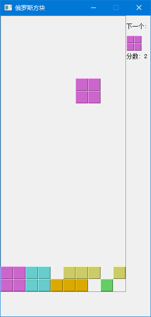

# 俄罗斯方块游戏

本章通过一个完整的俄罗斯方块游戏，综合运用前面学到的知识。

---

## 1. 游戏简介

俄罗斯方块是最流行的电脑游戏之一。由俄罗斯程序员 Alexey Pajitnov 于 1985 年设计和编程。

游戏规则：
- 七种不同形状的方块从顶部掉落
- 玩家可以旋转和移动方块
- 当一行被填满时，该行会被清除并得分
- 当方块堆叠到顶部时，游戏结束

---

## 2. 七种方块图示

俄罗斯方块由七种不同形状的方块组成，每个方块由4个小格子组成：

```
         I形                    J形                    L形
    ■ ■ ■ ■              ■                 ■
                              ■ ■ ■               ■ ■ ■
                                                ■


         T形                    O形                    S形
           ■                  ■ ■                   ■ ■
        ■ ■ ■                ■ ■                     ■ ■
                                                Z形                   
           ■ ■                                       ■ ■
          ■                                       ■


    （所有方块都是4格组成）
```

**记忆口诀**：I、J、L像字母，T像T，O是正方，S像S，Z像Z

---

## 3. 游戏界面布局

```
┌─────────────────────────────────────┐
│                                     │
│  ┌───────────────────────┐         │
│  │                       │  下一个:  │
│  │                       │   ■ ■    │
│  │     游戏区域            │   ■ ■    │
│  │     10列 × 22行        │          │
│  │                       │  分数:    │
│  │                       │   0      │
│  │                       │          │
│  └───────────────────────┘         │
│                                     │
└─────────────────────────────────────┘
```



**游戏区域**：10列宽，22行高，占据窗口左侧
**预览区**：显示下一个将要出现的方块（位于右侧）
**分数区**：显示当前得分（位于右侧）

---

## 4. 游戏主循环

俄罗斯方块的核心是一个不断重复的循环：

```
┌─────────────────────────────────────────┐
│                                         │
│   ┌─────────┐    ┌──────────────┐       │
│   │开始游戏 │───→│ 定时器触发    │       │
│   └─────────┘    │ 下落一行     │       │
│                  └───┬──────────┘       │
│                      │                  │
│                      ↓                  │
│              ┌──────────────┐           │
│              │   能否下落？   │           │
│              └───────┬──────┘           │
│                      │                  │
│           ┌──────────┴──────────┐        │
│           ↓                     ↓        │
│      能下落                 不能下落       │
│           │                     │        │
│           ↓                     ↓        │
│   ┌───────────────┐    ┌─────────────┐  │
│   │  玩家操作     │    │  固定方块    │  │
│   │ 左移/右移    │    │ 到棋盘上     │  │
│   │ 旋转/加速   │    └──────┬──────┘  │
│   └───┬─────────┘           │          │
│       │                     ↓          │
│       │              ┌─────────────┐    │
│       │              │  消除满行   │    │
│       │              └──────┬─────┘    │
│       │                     │          │
│       │                     ↓          │
│       │              ┌─────────────┐    │
│       └─────────────→│ 生成新方块  │────┘
│                      └─────────────┘
│                         (返回循环)
└─────────────────────────────────────────┘
```

**简化版主循环**：
```
定时器触发 → 下落一行 → 不能下落 → 落定 → 消行 → 新方块 → 循环
```

---

## 5. 从零构建：简化版到完整版

让我们从最简单的版本开始，逐步添加功能。

### 5.1 版本1：只有下落的简化版

```python
# -*- coding: utf-8 -*-
from PyQt5.QtWidgets import QMainWindow, QFrame, QApplication
from PyQt5.QtCore import Qt, QBasicTimer
from PyQt5.QtGui import QPainter, QColor
import sys

class Board(QFrame):
    BoardWidth = 10
    BoardHeight = 22

    def __init__(self):
        super().__init__()
        self.board = [[0] * self.BoardWidth for _ in range(self.BoardHeight)]
        self.timer = QBasicTimer()
        self.timer.start(500, self)  # 每500ms下落一次
        self.setFixedSize(200, 400)

    def timerEvent(self, event):
        print("下落一行")  # 先只打印，不实际移动

app = QApplication([])
board = Board()
board.show()
sys.exit(app.exec_())
```

**这个版本只干一件事**：每500毫秒打印"下落一行"（还没有方块显示）

---

### 5.2 版本2：加入方块和下落逻辑

```python
# -*- coding: utf-8 -*-
from PyQt5.QtWidgets import QMainWindow, QFrame, QApplication
from PyQt5.QtCore import Qt, QBasicTimer
from PyQt5.QtGui import QPainter, QColor
import sys

class Shape:
    coordsTable = (
        ((0, 0), (0, 0), (0, 0), (0, 0)),
        ((0, -1), (0, 0), (-1, 0), (-1, 1)),  # I形
        ((0, -1), (0, 0), (1, 0), (1, 1)),   # J形
    )
    def __init__(self):
        self.coords = [[0, 0] for _ in range(4)]
        self.setShape(1)  # 默认I形

    def setShape(self, shape):
        table = self.coordsTable[shape]
        for i in range(4):
            self.coords[i][0] = table[i][0]
            self.coords[i][1] = table[i][1]

    def x(self, i): return self.coords[i][0]
    def y(self, i): return self.coords[i][1]

class Board(QFrame):
    BoardWidth = 10
    BoardHeight = 22

    def __init__(self):
        super().__init__()
        self.board = [[0] * self.BoardWidth for _ in range(self.BoardHeight)]
        self.curPiece = Shape()
        self.curX = 5
        self.curY = 0
        self.timer = QBasicTimer()
        self.timer.start(500, self)
        self.setFixedSize(200, 400)

    def paintEvent(self, event):
        """绘制游戏画面"""
        painter = QPainter(self)
        cellWidth = self.width() // self.BoardWidth
        cellHeight = self.height() // self.BoardHeight

        # 绘制当前方块
        for i in range(4):
            x = self.curX + self.curPiece.x(i)
            y = self.curY + self.curPiece.y(i)
            painter.fillRect(x * cellWidth, y * cellHeight,
                           cellWidth - 1, cellHeight - 1,
                           QColor(0x66CC66))  # 绿色

    def timerEvent(self, event):
        # 简单下落：Y+1
        if self.curY < self.BoardHeight - 1:
            self.curY += 1
        self.update()

app = QApplication([])
board = Board()
board.show()
sys.exit(app.exec_())
```

**新版本学到了**：方块对象、下落逻辑、绘制

---

### 5.3 版本3：加入碰撞检测和键盘控制

```python
# -*- coding: utf-8 -*-
from PyQt5.QtWidgets import QMainWindow, QFrame, QApplication
from PyQt5.QtCore import Qt, QBasicTimer
from PyQt5.QtGui import QPainter, QColor
import sys

class Shape:
    coordsTable = (
        ((0, 0), (0, 0), (0, 0), (0, 0)),
        ((0, -1), (0, 0), (-1, 0), (-1, 1)),
        ((0, -1), (0, 0), (1, 0), (1, 1)),
    )
    def __init__(self):
        self.coords = [[0, 0] for _ in range(4)]
        self.setShape(1)

    def setShape(self, shape):
        table = self.coordsTable[shape]
        for i in range(4):
            self.coords[i][0] = table[i][0]
            self.coords[i][1] = table[i][1]

    def x(self, i): return self.coords[i][0]
    def y(self, i): return self.coords[i][1]

class Board(QFrame):
    BoardWidth = 10
    BoardHeight = 22

    def __init__(self):
        super().__init__()
        self.board = [[0] * self.BoardWidth for _ in range(self.BoardHeight)]
        self.curPiece = Shape()
        self.curX = 5
        self.curY = 0
        self.setFocusPolicy(Qt.StrongFocus)  # 关键：获取键盘焦点
        self.timer = QBasicTimer()
        self.timer.start(500, self)
        self.setFixedSize(200, 400)

    def paintEvent(self, event):
        """绘制游戏画面"""
        painter = QPainter(self)
        cellWidth = self.width() // self.BoardWidth
        cellHeight = self.height() // self.BoardHeight

        # 绘制已落下的方块（棋盘上的）
        for y in range(self.BoardHeight):
            for x in range(self.BoardWidth):
                if self.board[y][x] != 0:
                    painter.fillRect(x * cellWidth, y * cellHeight,
                                   cellWidth - 1, cellHeight - 1,
                                   QColor(0x6666CC))  # 蓝色

        # 绘制当前方块
        for i in range(4):
            x = self.curX + self.curPiece.x(i)
            y = self.curY + self.curPiece.y(i)
            if y >= 0:
                painter.fillRect(x * cellWidth, y * cellHeight,
                               cellWidth - 1, cellHeight - 1,
                               QColor(0x66CC66))  # 绿色

    def tryMove(self, newX, newY):
        """碰撞检测"""
        for i in range(4):
            x = newX + self.curPiece.x(i)
            y = newY + self.curPiece.y(i)
            if x < 0 or x >= self.BoardWidth or y >= self.BoardHeight:
                return False
            if y >= 0 and self.board[y][x] != 0:
                return False
        self.curX = newX
        self.curY = newY
        self.update()
        return True

    def keyPressEvent(self, event):
        if event.key() == Qt.Key_Left:
            self.tryMove(self.curX - 1, self.curY)
        elif event.key() == Qt.Key_Right:
            self.tryMove(self.curX + 1, self.curY)

    def timerEvent(self, event):
        if not self.tryMove(self.curX, self.curY + 1):
            # 落定了，固定方块到棋盘
            for i in range(4):
                x = self.curX + self.curPiece.x(i)
                y = self.curY + self.curPiece.y(i)
                if y >= 0:
                    self.board[y][x] = 1
            self.curY = 0  # 重置位置

app = QApplication([])
board = Board()
board.show()
sys.exit(app.exec_())
```

**新版本学到了**：碰撞检测、键盘控制、方块落定

---

### 5.4 最终版本：完整功能

在简化版基础上添加：
- 消行逻辑
- 七种方块
- 旋转功能
- 预览下一个方块
- 计分系统（作为思考题）

这就是我们完整版代码的设计思路！

---

## 6. 完整代码

```python
# -*- coding: utf-8 -*-

from PyQt5.QtWidgets import QMainWindow, QFrame, QDesktopWidget, QApplication
from PyQt5.QtCore import Qt, QBasicTimer, pyqtSignal
from PyQt5.QtGui import QPainter, QColor 
import sys, random

class Tetris(QMainWindow):

    def __init__(self):
        super().__init__()

        self.initUI()


    def initUI(self):
        """初始化游戏窗口界面"""
        self.tboard = Board(self)
        self.setCentralWidget(self.tboard)

        self.tboard.start()

        self.setFixedSize(300, 600)
        self.center()
        self.setWindowTitle('俄罗斯方块')
        self.show()


    def center(self):
        """将游戏窗口居中显示在屏幕上"""

        screen = QDesktopWidget().screenGeometry()
        size = self.geometry()
        self.move((screen.width()-size.width())/2, 
            (screen.height()-size.height())/2)


class Board(QFrame):

    msg2Statusbar = pyqtSignal(str)

    BoardWidth = 10      # 棋盘宽度（列数）
    BoardHeight = 22     # 棋盘高度（行数）
    Speed = 300          # 方块下落速度（毫秒），数字越小速度越快

    def __init__(self, parent):
        super().__init__(parent)

        self.initBoard()


    def initBoard(self):
        """初始化游戏棋盘数据"""
        self.timer = QBasicTimer()  # 游戏主定时器
        self.isWaitingAfterLine = False  # 消行后等待标志
        self.curPiece = Shape()    # 当前控制的方块
        self.nextPiece = Shape()   # 下一个方块
        self.curX = 0              # 当前方块X位置
        self.curY = 0              # 当前方块Y位置
        self.numLinesRemoved = 0   # 已消除的行数
        self.board = []            # 棋盘数据（二维数组）

        self.setFocusPolicy(Qt.StrongFocus)  # 强制获取键盘焦点
        self.isStarted = False     # 游戏是否已开始
        self.isPaused = False      # 游戏是否暂停
        self.isGameOver = False    # 游戏是否结束
        self.clearBoard()

        self.nextPiece.setRandomShape()  # 预生成下一个方块


    def clearBoard(self):
        """清空游戏棋盘，将所有格子置为0"""
        self.board = []
        for i in range(Board.BoardHeight):
            self.board.append([0 for _ in range(Board.BoardWidth)])


    def paintEvent(self, event):
        """绘制游戏界面，包括棋盘、当前方块、下一个方块和分数"""

        painter = QPainter(self)
        rect = self.rect()

        if self.isPaused:
            painter.drawText(rect, Qt.AlignCenter, "暂停")
            return

        if self.isGameOver:
            painter.drawText(rect, Qt.AlignCenter, "游戏结束")
            return

        boardTop = rect.top()
        boardLeft = rect.left()

        self.drawBoard(painter, boardTop, boardLeft)
        self.drawNextPiece(painter, boardLeft, boardTop)
        self.drawScore(painter, boardLeft, boardTop)


    def drawBoard(self, painter, boardTop, boardLeft):
        """绘制游戏棋盘区域，包括已落下的方块和边框"""

        availableWidth = self.contentsRect().width()
        availableHeight = self.contentsRect().height() - 50

        cellWidth = availableWidth // Board.BoardWidth
        cellHeight = availableHeight // Board.BoardHeight

        cellSize = min(cellWidth, cellHeight)  # 取最小值保证方块是正方形

        boardWidth = cellSize * Board.BoardWidth
        boardHeight = cellSize * Board.BoardHeight

        painter.setPen(QColor(150, 150, 150))
        painter.drawRect(boardLeft, boardTop, boardWidth, boardHeight)

        for i in range(Board.BoardHeight):
            for j in range(Board.BoardWidth):
                shape = self.board[i][j]
                if shape != 0:
                    self.drawSquare(painter,
                        boardLeft + j * cellSize,
                        boardTop + i * cellSize,
                        cellSize, cellSize, shape)

        if self.curPiece.shape() != 0:
            for i in range(4):
                x = self.curX + self.curPiece.x(i)
                y = self.curY + self.curPiece.y(i)
                self.drawSquare(painter,
                    boardLeft + x * cellSize,
                    boardTop + y * cellSize,
                    cellSize, cellSize,
                    self.curPiece.shape())


    def drawSquare(self, painter, x, y, cellWidth, cellHeight, shape):
        """绘制单个方块，带有3D效果的颜色"""

        # 颜色表：0=空(黑色), 1-7=7种不同颜色的方块
        colorTable = [0x000000, 0xCC6666, 0x66CC66, 0x6666CC,
                      0xCCCC66, 0xCC66CC, 0x66CCCC, 0xDAAA00]

        color = QColor(colorTable[shape])
        # 绘制方块主体，四周留1像素边距
        painter.fillRect(x + 1, y + 1, cellWidth - 2, cellHeight - 2, color)

        # 左上边：高亮色，产生凸起效果
        painter.setPen(color.lighter())
        painter.drawLine(x, y + cellHeight - 1, x, y)           # 左边
        painter.drawLine(x, y, x + cellWidth - 1, y)             # 上边

        # 右下边：深色，产生凹陷效果
        painter.setPen(color.darker())
        painter.drawLine(x + 1, y + cellHeight - 1,
                         x + cellWidth - 1, y + cellHeight - 1)  # 下边
        painter.drawLine(x + cellWidth - 1, y + cellHeight - 1,
                         x + cellWidth - 1, y + 1)               # 右边


    def drawNextPiece(self, painter, boardLeft, boardTop):
        """在游戏区域右侧绘制下一个即将出现的方块预览"""

        availableWidth = self.contentsRect().width()
        availableHeight = self.contentsRect().height() - 50

        cellWidth = availableWidth // Board.BoardWidth
        cellHeight = availableHeight // Board.BoardHeight
        cellSize = min(cellWidth, cellHeight)

        boardWidth = cellSize * Board.BoardWidth
        boardHeight = cellSize * Board.BoardHeight

        painter.setPen(QColor(0, 0, 0))
        previewX = boardLeft + boardWidth + 2
        painter.drawText(previewX, boardTop + 25, "下一个:")

        previewSize = 15
        for i in range(4):
            x = previewX + self.nextPiece.x(i) * previewSize
            y = boardTop + 40 + self.nextPiece.y(i) * previewSize
            self.drawSquare(painter, x, y, previewSize, previewSize, self.nextPiece.shape())


    def drawScore(self, painter, boardLeft, boardTop):
        """在游戏区域右侧绘制当前得分"""

        availableWidth = self.contentsRect().width()
        availableHeight = self.contentsRect().height() - 50

        cellWidth = availableWidth // Board.BoardWidth
        cellHeight = availableHeight // Board.BoardHeight
        cellSize = min(cellWidth, cellHeight)

        boardWidth = cellSize * Board.BoardWidth

        painter.setPen(QColor(0, 0, 0))
        previewX = boardLeft + boardWidth + 2
        painter.drawText(previewX, boardTop + 85, f"分数: {self.numLinesRemoved}")


    def timerEvent(self, event):
        """定时器事件，每隔Speed毫秒自动下落一行"""

        if event.timerId() == self.timer.timerId():
            if self.isWaitingAfterLine:  # 消行后等待状态
                self.isWaitingAfterLine = False
                self.newPiece()
                self.oneLineDown()
            else:
                self.oneLineDown()
        else:
            super().timerEvent(event)


    def keyPressEvent(self, event):
        """处理键盘按键事件，实现方块的移动、旋转和快速下落"""

        if not self.isStarted or self.curPiece.shape() == 0:
            super().keyPressEvent(event)
            return

        key = event.key()

        if key == Qt.Key_P:  # P键暂停
            self.pause()
            return

        if self.isPaused:
            return
        elif key == Qt.Key_Left:   # 左移
            self.tryMove(self.curPiece, self.curX - 1, self.curY)
        elif key == Qt.Key_Right:  # 右移
            self.tryMove(self.curPiece, self.curX + 1, self.curY)
        elif key == Qt.Key_Down:   # 下落加速
            self.tryMove(self.curPiece, self.curX, self.curY + 1)
        elif key == Qt.Key_Up:     # 左旋转
            self.tryMove(self.curPiece.rotateLeft(), self.curX, self.curY)
        elif key == Qt.Key_Space:  # 直接落到底部
            self.dropDown()
        elif key == Qt.Key_D:      # 软降（下落一行）
            self.oneLineDown()


    def dropDown(self):
        """空格键处理，直接将方块下落到最底部"""

        newY = self.curY

        while newY < Board.BoardHeight - 1:
            if not self.tryMove(self.curPiece, self.curX, newY + 1):
                break
            newY += 1

        self.pieceDropped()


    def oneLineDown(self):
        """将当前方块向下移动一行，如果不能移动则放置方块"""

        if not self.tryMove(self.curPiece, self.curX, self.curY + 1):
            self.pieceDropped()


    def pieceDropped(self):
        """将当前方块固定到棋盘上，并触发消行检测和新方块生成"""

        for i in range(4):
            x = self.curX + self.curPiece.x(i)
            y = self.curY + self.curPiece.y(i)
            self.board[y][x] = self.curPiece.shape()

        self.removeFullLines()

        if not self.isWaitingAfterLine:
            self.newPiece()


    def removeFullLines(self):
        """检测并消除满行，被消除的行上面的方块会下落"""

        numFullLines = 0
        rowsToRemove = []

        # 遍历每一行，检查是否填满（10个格子都有方块）
        for i in range(Board.BoardHeight):
            n = 0
            for j in range(Board.BoardWidth):
                if self.board[i][j] != 0:  # 0表示空格子
                    n = n + 1

            if n == Board.BoardWidth:  # 10个格子都满了
                rowsToRemove.append(i)

        rowsToRemove.reverse()  # 从下往上消除，避免索引错位

        # 消除满行：将被消除行下面的所有行下移
        for m in rowsToRemove:
            for k in range(m, Board.BoardHeight - 1):
                for l in range(Board.BoardWidth):
                    self.board[k][l] = self.board[k + 1][l]

        # 在顶部插入空行，补充被消除的行数
        for _ in rowsToRemove:
            self.board.insert(0, [0 for _ in range(Board.BoardWidth)])

        numFullLines = len(rowsToRemove)

        if numFullLines > 0:
            self.numLinesRemoved += numFullLines
            self.isWaitingAfterLine = True
            self.curPiece.setShape(0)
            self.update()


    def newPiece(self):
        """生成一个新的方块，设置其为当前方块，并随机生成下一个方块"""

        self.curPiece = self.nextPiece
        self.nextPiece.setRandomShape()
        # 在棋盘顶部中央位置生成新方块
        self.curX = Board.BoardWidth // 2 + 1  # 10//2+1=6，居中偏左
        self.curY = 2  # 从顶部第2行开始出现

        if not self.tryMove(self.curPiece, self.curX, self.curY):
            self.curPiece.setShape(0)
            self.msg2Statusbar.emit("游戏结束")
            self.isGameOver = True
            self.timer.stop()


    def tryMove(self, newPiece, newX, newY):
        """尝试将方块移动到指定位置，检查是否合法并更新位置"""

        for i in range(4):  # 检查方块的4个坐标点
            x = newX + newPiece.x(i)
            y = newY + newPiece.y(i)

            # 检查是否超出棋盘边界
            if x < 0 or x >= Board.BoardWidth or y < 0 or y >= Board.BoardHeight:
                return False

            # 检查目标位置是否有其他方块
            if self.board[y][x] != 0:
                return False

        # 移动成功，更新方块位置
        self.curPiece = newPiece
        self.curX = newX
        self.curY = newY
        self.update()

        return True


    def pause(self):
        """暂停/继续游戏切换"""

        if not self.isStarted:
            return

        self.isPaused = not self.isPaused

        if self.isPaused:
            self.timer.stop()
            self.msg2Statusbar.emit("暂停")
        else:
            self.timer.start(Board.Speed, self)

        self.update()


    def start(self):
        """开始或重新开始游戏，初始化游戏状态并启动定时器"""

        if self.isPaused:
            return

        self.isStarted = True
        self.isWaitingAfterLine = False
        self.numLinesRemoved = 0
        self.clearBoard()

        self.newPiece()
        self.timer.start(Board.Speed, self)


class Shape:

    # 方块坐标表：每种方块由4个坐标点(x,y)组成
    # 索引0=空方块, 1=_I形, 2=_J形, 3=_L形, 4=__T形, 5=__O形, 6=__S形, 7=__Z形
    coordsTable = (
        ((0, 0),     (0, 0),     (0, 0),     (0, 0)),  # 0: 空方块
        ((0, -1),    (0, 0),     (-1, 0),    (-1, 1)), # 1: I形 - 水平放置
        ((0, -1),    (0, 0),     (1, 0),     (1, 1)),  # 2: J形
        ((0, -1),    (0, 0),     (0, 1),     (0, 2)),  # 3: L形
        ((-1, 0),    (0, 0),     (1, 0),     (0, 1)),  # 4: T形
        ((0, 0),     (1, 0),     (0, 1),     (1, 1)),  # 5: O形 - 正方形
        ((-1, -1),   (0, -1),    (0, 0),     (0, 1)),  # 6: S形
        ((1, -1),    (0, -1),    (0, 0),     (0, 1))   # 7: Z形
    )

    def __init__(self):

        self.coords = [[0, 0] for _ in range(4)]
        self.pieceShape = 0

        self.setShape(0)


    def shape(self):
        """返回当前方块的类型编号"""
        return self.pieceShape


    def setShape(self, shape):
        """设置方块的类型，根据类型编号从坐标表中加载形状数据"""

        table = Shape.coordsTable[shape]
        for i in range(4):
            for j in range(2):
                self.coords[i][j] = table[i][j]

        self.pieceShape = shape


    def setRandomShape(self):
        """随机设置一个方块类型（1-7）"""
        self.setShape(random.randint(1, 7))


    def x(self, index):
        """返回方块第index个坐标点的x值"""
        return self.coords[index][0]


    def y(self, index):
        """返回方块第index个坐标点的y值"""
        return self.coords[index][1]


    def setX(self, index, x):
        """设置方块第index个坐标点的x值"""
        self.coords[index][0] = x


    def setY(self, index, y):
        """设置方块第index个坐标点的y值"""
        self.coords[index][1] = y


    def minX(self):
        """返回方块坐标中x的最小值"""
        m = self.coords[0][0]
        for i in range(4):
            if m > self.coords[i][0]:
                m = self.coords[i][0]
        return m


    def maxX(self):
        """返回方块坐标中x的最大值"""
        m = self.coords[0][0]
        for i in range(4):
            if m < self.coords[i][0]:
                m = self.coords[i][0]
        return m


    def minY(self):
        """返回方块坐标中y的最小值"""
        m = self.coords[0][1]
        for i in range(4):
            if m > self.coords[i][1]:
                m = self.coords[i][1]
        return m


    def maxY(self):
        """返回方块坐标中y的最大值"""
        m = self.coords[0][1]
        for i in range(4):
            if m < self.coords[i][1]:
                m = self.coords[i][1]
        return m


    def rotateLeft(self):
        """将方块向左旋转90度"""

        if self.pieceShape == 0:  # 空方块不能旋转
            return self

        result = Shape()
        result.pieceShape = self.pieceShape

        # 旋转公式：(x, y) -> (y, -x)
        for i in range(4):
            result.setX(i, self.y(i))
            result.setY(i, -self.x(i))

        return result


    def rotateRight(self):
        """将方块向右旋转90度"""

        if self.pieceShape == 0:  # 空方块不能旋转
            return self

        result = Shape()
        result.pieceShape = self.pieceShape

        # 旋转公式：(x, y) -> (-y, x)
        for i in range(4):
            result.setX(i, -self.y(i))
            result.setY(i, self.x(i))

        return result


if __name__ == '__main__':

    app = QApplication([])
    tetris = Tetris()
    sys.exit(app.exec_())
```

---

## 7. 游戏操作

| 按键 | 功能 |
|------|------|
| ← | 左移 |
| → | 右移 |
| ↑ | 左旋转 |
| ↓ | 加速下落 |
| 空格 | 直接落到底部 |
| D | 下一行 |
| P | 暂停/继续 |

---

## 8. 代码结构分析

### 8.1 主要类

| 类名 | 职责 |
|------|------|
| `Tetris` | 主窗口，初始化界面 |
| `Board` | 游戏面板，处理游戏逻辑 |
| `Shape` | 方块形状定义和操作 |

### 8.2 核心方法详解

#### tryMove() - 方块移动的核心判官

```python
def tryMove(self, newPiece, newX, newY):
    for i in range(4):  # 方块由4个格子组成
        x = newX + newPiece.x(i)  # 计算第i个格子的绝对坐标
        y = newY + newPiece.y(i)

        # 超出边界？撞墙了！
        if x < 0 or x >= Board.BoardWidth or y < 0 or y >= Board.BoardHeight:
            return False

        # 目标位置有其他方块？撞山了！
        if self.board[y][x] != 0:
            return False

    # 所有检查通过，可以移动
    self.curPiece = newPiece
    self.curX = newX
    self.curY = newY
    self.update()  # 重绘画面
    return True
```

**通俗解释**：这个方法就像游戏的"交通警察"。方块想移动到新位置？先来我这报备！警察会检查：
1. 你要去的地方在棋盘内吗？
2. 你要去的地方被其他方块占了吗？

两个都OK？放行！否则乖乖待着。

---

#### newPiece() - 新方块的诞生

```python
def newPiece(self):
    self.curPiece = self.nextPiece          # 下一个变成当前
    self.nextPiece.setRandomShape()         # 随机生成新的下一个
    self.curX = Board.BoardWidth // 2 + 1   # 居中位置（X=6）
    self.curY = 2                          # 从顶部开始

    if not self.tryMove(self.curPiece, self.curX, self.curY):
        # 放不下了，游戏结束！
        self.curPiece.setShape(0)
        self.msg2Statusbar.emit("游戏结束")
        self.isGameOver = True
        self.timer.stop()
```

**通俗解释**：当一个方块落定后，需要生成新的方块继续游戏。
1. 把"下一个方块"变成"当前方块"
2. 随机生成一个全新的"下一个方块"
3. 把新方块放到棋盘顶部的中央位置
4. 如果放不进去（比如棋盘满了），游戏结束！

---

#### removeFullLines() - 消行的秘密

```python
def removeFullLines(self):
    rowsToRemove = []

    # 第一步：找出所有满行
    for i in range(Board.BoardHeight):  # 从下往上检查每一行
        n = 0
        for j in range(Board.BoardWidth):  # 检查这行的10个格子
            if self.board[i][j] != 0:      # 有方块？
                n += 1
        if n == Board.BoardWidth:          # 10个格子都满了？
            rowsToRemove.append(i)           # 记录下来

    # 第二步：从下往上消除（关键！）
    rowsToRemove.reverse()
    for m in rowsToRemove:
        for k in range(m, Board.BoardHeight - 1):
            for l in range(Board.BoardWidth):
                self.board[k][l] = self.board[k + 1][l]  # 上面一行掉下来

    # 第三步：顶部补空行
    for _ in rowsToRemove:
        self.board.insert(0, [0 for _ in range(Board.BoardWidth)])
```

**为什么从下往上消除？**

想象一下：你有一叠纸，第5张和第7张是满行要消除。
- 如果你先消第7张，抽出后第8张就变成第7张了，索引全乱了
- 如果你从下往上消，先消第7张，再消第5张，索引不会乱

**通俗解释**：消行就像收拾桌面：
1. 扫描一遍，找出哪些行是满的
2. 从下往上，把满行上面的所有行往下挪
3. 挪完后，顶部会空出几行，用空行填满

---

#### dropDown() - 快速落底

```python
def dropDown(self):
    newY = self.curY
    while newY < Board.BoardHeight - 1:
        if not self.tryMove(self.curPiece, self.curX, newY + 1):
            break  # 撞东西了，不能再落
        newY += 1
    self.pieceDropped()  # 固定方块
```

**通俗解释**：按空格键时，方块会"自由落体"到底部。它一直往下跳，每跳一行问问`tryMove`能不能落，能落就继续，直到撞到东西或到底为止。

---

#### rotateLeft() - 方块旋转的数学

```python
def rotateLeft(self):
    result = Shape()
    for i in range(4):
        result.setX(i, self.y(i))    # 新X = 旧Y
        result.setY(i, -self.x(i))   # 新Y = -旧X
    return result
```

**旋转公式图解**：

```
原坐标 (x, y)     旋转90°后 (y, -x)

    ↑ y
    |
    +----→ x

         (x,y)          (0,1) 绕原点旋转90°  (1,0)
           ●                ↓
                              → (1,0) 错了！
                              
正确： (x,y)=(1,0) 旋转90° → (y,-x)=(0,-1)
      (x,y)=(0,1) 旋转90° → (y,-x)=(1,0)
```

**通俗解释**：把方块看成一个整体，每个格子都绕中心点转90度。用数学公式就是：新位置 = (旧Y, -旧X)。

---

#### 棋盘坐标系详解

```python
self.board = []  # 二维数组
for i in range(Board.BoardHeight):  # 22行
    self.board.append([0 for _ in range(Board.BoardWidth)])  # 每行10列
```

**棋盘布局**：
```
     X: 0  1  2  3  4  5  6  7  8  9
Y=0  ┌─────────────────────────────┐
Y=1  │                             │
Y=2  │      ■ ■ ■ ■               │  ← 新方块从这里开始
...  │                             │
Y=21 │                             │
     └─────────────────────────────┘
```

- `self.board[y][x]` 表示第y行第x列的格子
- 值为0表示空，非0表示有方块（1-7代表不同颜色）
- Y值越大越靠下，方块往下落就是Y增大

---

| 方法 | 说明 |
|------|------|
| `start()` | 开始游戏 |
| `pause()` | 暂停/继续 |
| `newPiece()` | 生成新方块 |
| `oneLineDown()` | 方块下落一行 |
| `dropDown()` | 方块直接落到底部 |
| `removeFullLines()` | 清除满行 |
| `tryMove()` | 尝试移动方块 |

---

## 9. 思考题与练习

动手实践是最好的学习方式！试试完成以下练习吧。

---

### 练习1：添加重新开始功能

**问题**：目前游戏结束后只能关闭窗口重来，能否在游戏结束时按 R 键重新开始？

**思路**：
1. 在 `keyPressEvent()` 中添加 R 键的处理
2. 调用 `start()` 方法重新初始化游戏
3. 或者直接调用 `initBoard()` 再调用 `start()`

**实现**：

```python
def keyPressEvent(self, event):
    # ... 其他按键处理 ...

    if key == Qt.Key_R:  # R键重新开始
        self.start()
        return
```

然后修改 `start()` 方法，让它能在游戏结束后重新开始：

```python
def start(self):
    # 即使游戏结束也能重新开始，所以去掉 isPaused 的检查
    # 或者改为：
    # if self.isPaused:
    #     return

    self.isStarted = True
    self.isWaitingAfterLine = False
    self.isGameOver = False  # 重置游戏结束状态
    self.numLinesRemoved = 0
    self.clearBoard()

    self.msg2Statusbar.emit(str(self.numLinesRemoved))

    self.newPiece()
    self.timer.start(Board.Speed, self)
```

---

### 练习2：实现计分系统

**问题**：现在只显示消除行数，能否根据消除行数计算得分？

**思路**：
1. 定义分数表：消1行100分，消2行300分，消3行500分，消4行800分
2. 在 `removeFullLines()` 中计算并累加分数
3. 添加 `self.score` 变量存储分数
4. 在状态栏或界面上显示分数

**实现**：

首先在 `initBoard()` 中添加分数变量：

```python
self.score = 0  # 添加分数
```

修改 `removeFullLines()` 中的计分逻辑：

```python
# 计分表：消行数 -> 分数
scoreTable = {1: 100, 2: 300, 3: 500, 4: 800}

numFullLines = len(rowsToRemove)
if numFullLines > 0:
    # 根据消除行数计算分数
    self.score += scoreTable.get(numFullLines, 0)
    self.numLinesRemoved += numFullLines
    self.msg2Statusbar.emit(f"得分:{self.score} 行数:{self.numLinesRemoved}")
    self.isWaitingAfterLine = True
    self.curPiece.setShape(0)
    self.update()
```

---

### 练习3：速度随行数加快

**问题**：标准俄罗斯方块会越玩越快，能否实现？

**思路**：
1. 定义速度数组：`[300, 250, 200, 150, 100, 50]`
2. 根据消除行数决定当前速度
3. 每消10行升级一次速度
4. 在 `removeFullLines()` 和 `start()` 中更新速度

**实现**：

首先在类级别添加速度表：

```python
Speed = 300
SpeedLevels = [300, 250, 200, 150, 100, 50, 30]  # 速度越来越快
```

修改 `start()` 方法，在开始时设置速度：

```python
def start(self):
    # ... 其他初始化代码 ...

    # 根据等级设置速度（每10行升一级）
    level = min(self.numLinesRemoved // 10, len(self.SpeedLevels) - 1)
    self.timer.start(self.SpeedLevels[level], self)
```

修改 `removeFullLines()`，在消行后更新速度：

```python
if numFullLines > 0:
    self.numLinesRemoved += numFullLines

    # 检查是否升级
    newLevel = min(self.numLinesRemoved // 10, len(self.SpeedLevels) - 1)
    currentLevel = min((self.numLinesRemoved - numFullLines) // 10, len(self.SpeedLevels) - 1)

    if newLevel > currentLevel:
        # 升级了！加速
        level = min(self.numLinesRemoved // 10, len(self.SpeedLevels) - 1)
        self.timer.start(self.SpeedLevels[level], self)

    # ... 其他代码 ...
```

---

### 练习4：显示下一个方块预览

**问题**：当前代码已经有 `drawNextPiece()` 方法绘制预览，但能否把它放到游戏区域右侧单独显示？

**思路**：
1. 修改窗口大小，给右侧留出空间
2. 调整 `drawNextPiece()` 的绘制位置
3. 调整分数显示位置
4. 可能需要修改窗口大小常量

**实现**（部分关键修改）：

```python
# 在 Board 类中添加
PreviewWidth = 80  # 右侧预览区宽度

def drawNextPiece(self, painter, boardLeft, boardTop):
    """在游戏区域右侧绘制下一个方块预览"""
    cellSize = 20  # 预览方块的格子大小

    painter.setPen(QColor(0, 0, 0))
    painter.drawText(boardLeft + 160, boardTop + 20, "下一个:")

    for i in range(4):
        x = boardLeft + 165 + self.nextPiece.x(i) * cellSize
        y = boardTop + 50 + self.nextPiece.y(i) * cellSize
        self.drawSquare(painter, x, y, cellSize, cellSize, self.nextPiece.shape())


def drawScore(self, painter, boardLeft, boardTop):
    """在游戏区域右侧绘制分数"""
    painter.setPen(QColor(0, 0, 0))
    painter.drawText(boardLeft + 160, boardTop + 150, "分数:")
    painter.drawText(boardLeft + 160, boardTop + 170, str(self.score))
    painter.drawText(boardLeft + 160, boardTop + 200, "行数:")
    painter.drawText(boardLeft + 160, boardTop + 220, str(self.numLinesRemoved))
```

---

## 10. 知识点总结

这个游戏综合运用了以下知识点：
- QMainWindow 主窗口
- 信号与槽机制
- 事件处理（键盘事件、定时器事件）
- QPainter 绘图
- 自定义组件
- 布局管理

---

恭喜！你已经完成了 PyQt5 的基础学习。接下来我们将学习 Qt Designer 可视化工具，让界面设计更加高效。